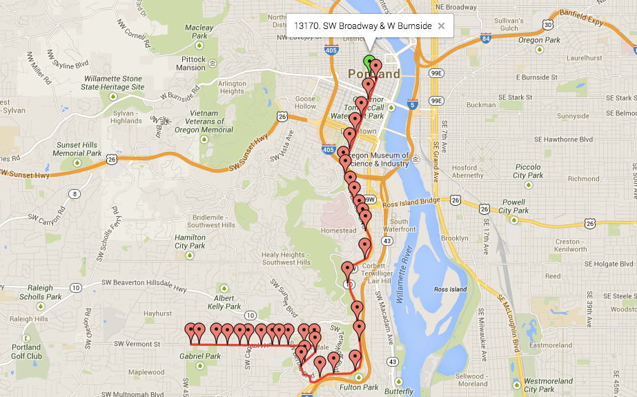

# The Definitive Guide to GTFS

*Consuming open public transportation data with the General Transit Feed
Specification*

Originally written by Quentin Zervaas.

## About This Book

This book is a comprehensive guide to GTFS -- the General Transit Feed
Specification. It is comprised of two main sections.

The first section describes what GTFS is and provides details about the
specification itself. In addition to this it also provides various
discussion points and things to consider for each of the files in the
specification.

The second section covers a number of topics that relate to actually
using GTFS feeds, such as how to calculate fares, how to search for
trips, how to optimize feed data and more.

This book is written for developers that are using transit data for web
sites, mobile applications and more. It aims to be as language-agnostic
as possible, but uses SQL to demonstrate concepts of extracting data
from a GTFS feed.

### About The Author

Quentin Zervaas is a software developer from Adelaide, Australia.

Quentin was the founder of TransitFeeds (now <OpenMobilityData.org>), a web
site that provides a comprehensive listing of public transportation data
available around the world. This site is referenced various times
throughout this book.

### Credits

First Edition. Published in February 2014.

**Technical Reviewer**

Rupert Hanson

**Copy Editor**

Miranda Little

**Disclaimer**

The information in this book is distributed on an "as is" basis, without
warranty. Although every precaution has been taken in the preparation of
this work, the author shall not be liable to any person or entity with
respect to any loss or damage caused or alleged to be caused directly or
indirectly by the information contained in this book.


## 1. Introduction to GTFS

GTFS (General Transit Feed Specification) is a data standard developed
by Google used to describe a public transportation system. Its primary
purpose was to enable public transit agencies to upload their schedules
to Google Transit so that users of Google Maps could easily figure out
which bus, train, ferry or otherwise to catch.

> **A GTFS feed is a ZIP file that contains a series of CSV files that
list routes, stops and trips in a public transportation system.**

This book examines GTFS in detail, including which data from a public
transportation system can be represented, how to extract data, and
explores some more advanced techniques for optimizing and querying data.

The official GTFS specification has been referenced a number of times in
this book. It is strongly recommended you are familiar with it. You can
view at the following URL:

<https://developers.google.com/transit/gtfs/reference>

### Structure of a GTFS Feed

A GTFS feed is a series of CSV files, which means that it is trivial to
include additional files in a feed. Additionally, files required as part
of the specification can also include additional columns. For this
reason, feeds from different agencies generally include different levels
of detail.

***Note:** The files in a GTFS feed are CSV files, but use a file
extension of `.txt`.*

A GTFS feed can be described as follows:

> **A GTFS feed has one or more routes. Each route (`routes.txt`) has one or
more trips (`trips.txt`). Each trip visits a series of stops (`stops.txt`)
at specified times (`stop_times.txt`). Trips and stop times only contain
time of day information; the calendar is used to determine on which days
a given trip runs (`calendar.txt` and `calendar_dates.txt`).**

The following chapters cover the main files that are included in all
GTFS feeds. For each file, the main columns are covered, as well as
optional columns that can be included. This book also covers some of the
unofficial columns that some agencies choose to include.


## 2. Agencies (agency.txt)

*This file is ***required*** to be included in GTFS feeds.*

The `agency.txt` file is used to represent the agencies that provide
data for this feed. While its presence is optional, if there are routes
from multiple agencies included, then records in `routes.txt` make
reference to agencies in this file.

| Field  | Required? | Description |
| :----------------------------------------------------- | :--------: | :-------- |
| `agency_id`                                            | Optional | An ID that uniquely identifies a single transit agency in the feed. If a feed only contains routes for a single agency then this value is optional. |
| `agency_name`                                          | Required | The full name of the transit agency. |
| `agency_url`                                           | Required | The URL of the transit agency. Must be a complete URL only, beginning with `http://` or `https://`. |
| `agency_timezone`                                      | Required | Time zone of agency. All times in `stop_times.txt` use this time zone, unless overridden by its corresponding stop. All agencies in a single feed must use the same time zone. Example: **America/New_York** (See <http://en.wikipedia.org/wiki/List_of_tz_database_time_zones> for more examples) |
| `agency_lang`                                          | Required | Contains a two-letter ISO-639-1 code (such as `en` or `EN` for English) for the language used in this feed. |
| `agency_phone`                                         | Optional | A single voice telephone number for the agency that users can dial if required. |
| `agency_fare_url`                                      | Optional | A URL that describes fare information for the agency. Must be a complete URL only, beginning with `http://` or `https://`. |

### Sample Data

The following extract is taken from the GTFS feed of TriMet (Portland,
USA), located at <https://openmobilitydata.org/p/trimet>.

| `agency_name` | `agency_url`                                 | `agency_timezone`     | `agency_lang` | `agency_phone`   |
| :------------ | :------------------------------------------- | :-------------------- | :------------ | :--------------- |
| `TriMet`      | `[https://trimets.org](https://trimet.org/)` | `America/Los_Angeles` | `en`          | `(503) 238-7433` | 

In this example, the `agency_id` column is included, but as there is
only a single entry the value can be empty. This means the `agency_id`
column in `routes.txt` also is not required.

### Discussion

The data in this file is typically used to provide additional
information to users of your app or web site in case schedules derived
from the rest of this feed are not sufficient (or in the case of
`agency_fare_url`, an easy way to provide a reference point to users
if the fare information in the feed is not being used).

If you refer to the following screenshot, taken from Google Maps, you
can see the information from `agency.txt` represented in the
lower-left corner as an example of how it can be used.


## 3. Stops & Stations (stops.txt)

*This file is ***required*** to be included in GTFS feeds.*

The individual locations where vehicles pick up or drop off passengers
are represented by `stops.txt`. Records in this file are referenced in
`stop_times.txt`. A record in this file can be either a stop or a
station. A station has one or more child stops, as indicated using the
`parent_station` value. Entries that are marked as stations may not
appear in `stop_times.txt`.

| Field  | Required? | Description |
| :----- | :-------- | :---------- |
| `stop_id` | Required | An ID to uniquely identify a stop or station. |
| `stop_code` | Optional | A number or short string used to identify a stop to passengers. This is typically displayed at the physical stop or on printed schedules. |
| `stop_name` | Required | The name of the stop as passengers know it by. |
| `stop_desc` | Optional | A description of the stop. If provided, this should provide additional information to the `stop_name` value. |
| `stop_lat` | Required | The latitude of the stop (a number in the range of `-90` to `90`). |
| `stop_lon` | Required | The longitude of the stop (a number in the range of `-180` to `180`). |
| `zone_id` | Optional | This is an identifier used to calculate fares. A single zone ID may appear in multiple stops, but is ignored if the stop is marked as a station. |
| `stop_url` | Optional | A URL that provides information about this stop. It should be specific to this stop and not simply link to the agency's web site. |
| `location_type` | Optional | Indicates if a record is a stop or station. `0` or blank means a stop, `1` means a station. |
| `parent_station` | Optional | If a record is marked as a stop and has a parent station, this contains the ID of the parent (the parent must have a `location_type` of `1`). |
| `stop_timezone` | Optional | If a stop is located in a different time zone to the one specified in `agency.txt`, then it can be overridden here. |
| `wheelchair_boarding` | Optional | A value of `1` indicates it is possible for passengers in wheelchairs to board or alight. A value of `2` means the stop is not wheelchair accessible, while `0` or an empty value means no information is available. If the stop has a parent station, then 0 or an empty value means to inherit from its parent. |

### Sample Data

The following extract is taken from the TriMet GTFS feed
(<https://openmobilitydata.org/p/trimet>).

| `stop_id` |  `stop_code` |  `stop_name`        | `stop_lat`  | `stop_lon`    | `stop_url`                                          |
| :-------- | :----------- | :------------------ | :---------- | :------------ | :---------------------------------------------------|
| `2`       | `2`          | `A Ave & Chandler`  | `45.420595` | `-122.675676` |` <http://trimet.org/arrivals/tracker?locationID=2>` |
| `3`       | `3`          | `A Ave & Second St` | `45.419386` | `-122.665341` |` <http://trimet.org/arrivals/tracker?locationID=3>` |
| `4`       | `4`          | `A Ave & 10th St`   | `45.420703` | `-122.675152` |` <http://trimet.org/arrivals/tracker?locationID=4>` |
| `6`       | `6`          | `A Ave & 8th St`    | `45.420217` | `-122.67307`  |` <http://trimet.org/arrivals/tracker?locationID=6>` |

The following diagram shows how these points look if you plot them onto
a map.


In this extract, TriMet use the same value for stop IDs and stop codes.
This is useful, because it means the stop IDs are stable (that is, they
do not change between feed versions). This means that if you want to
save a particular stop (for instance, if a user wants to save a
"favorite stop") you can trust that saving the ID will get the job done.

**Note:** This is not always the case though, which means you may have
to save additional information if you want to save a stop. For instance,
you may need to save the coordinates or the list of routes a stop serves
so you can find it again if the stop ID has changed in a future version
of the feed.

### Stops & Stations

Specifying an entry in this file as a *station* is typically used when
there are many stops located within a single physical entity, such as a
train station or bus depot. While many feeds do not offer this
information, some large train stations may have up to 20 or 30
platforms.

Knowing the platform for a specific trip is extremely useful, but if a
passenger wants to select a starting point for their trip, showing them
a list of platforms may be confusing.

Passenger:

**"I want to travel from *Central Station* to *Airport Station*."**

Web site / App:

**"Board at *Central Station platform 5*, disembark at *Airport Station platform 1*."**

In this example, the passenger selects the parent station, but they are
presented with the specific stop so they know exactly where within the
station they need to embark or disembark.

### Wheelchair Accessibility

If you are showing wheelchair accessibility information, it is important
to differentiate between "no access" and "no information", as knowing a
stop is not accessible is as important as knowing it is.

If a stop is marked as being wheelchair accessible, you must check that
trips that visit the stop are also accessible (using the
`wheelchair_accessible` field in `trips.txt`). If the value in
`trips.txt` is blank, `0` or `1` then it is safe to assume the
trip can be accessed. If the stop is accessible and the trip is not,
then passengers in wheelchairs cannot use the trip.

### Stop Features

One of the proposed changes to GTFS is the addition of a file called
`stop_features.txt`. This is used to define characteristics about
stops. The great thing about this file is that it allows you to indicate
to users when a stop has a ticket machine, bike storage, lighting, or an
electronic display with real-time information.

TriMet is one of the few agencies including this file. The following is
a sample of this file.

| `stop_id` | `feature_type` |
| :-------- | :------------- |
| `61`      | `4110`         |
| `61`      | `2310`         |
| `61`      | `5200`         |

This data indicate that stop `61` (NE Alberta & 24th) has a *Printed
Schedule Display* (`4110`), a *Bike Rack* (`2310`) and a *Street
Light* (`5200`).

For more information about this proposal and a list of values and their
meanings, refer to
<https://sites.google.com/site/gtfschanges/proposals/stop-amenity>.


## 4. Routes (routes.txt)

*This file is ***required*** to be included in GTFS feeds.*

A route is a group of trips that are displayed to riders as a single
service.

| Field  | Required? | Description |
| :----- | :-------- | :---------- |
| `route_id` | Required | An ID that uniquely identifies the route. |
| `agency_id` | Optional | The ID of the agency a route belongs to, as it appears in `agency.txt`. Only required if there are multiple agencies in the feed. |
| `route_short_name` | Required | A nickname or code to represent this service. If this is left empty then the `route_long_name` must be included. |
| `route_long_name` | Required | The route full name. If this is left empty then the `route_short_name` must be included. |
| `route_desc` | Optional | A description of the route, such as where and when the route operates. |
| `route_type` | Required | The type of transportation used on a route (such as bus, train or ferry). See below for more information. |
| `route_url` | Optional | A URL of a web page that describes this particular route. |
| `route_color` | Optional | If applicable, a route can have a color assigned to it. This is useful for systems that use colors to identify routes. This value is a six-character hexadecimal number (for example, `FF0000` is red). |
| `route_text_color` | Optional | For routes that specify the `route_color`, a corresponding text color should also be specified. |

### Sample Data

The following extract is taken from the TriMet GTFS feed
(<https://openmobilitydata.org/p/trimet>).

| `route_id` | `route_short_name` | `route_long_name`            | `route_type` |
| :--------- | :----------------- | :--------------------------- | :----------- |
| `1`        | `1`                | `Vermont`                    | `3`          |
| `4`        | `4`                | `Division / Fessenden`       | `3`          |
| `6`        | `6`                | `Martin Luther King Jr Blvd` | `3`          |

This sample shows three different bus routes for the greater Portland
area. The `route_type` value of `3` indicates they are buses. See
the next section for more information about route types in GTFS.

There is no agency ID value in this feed, as TriMet is the only agency
represented in the feed.

The other thing to note about this data is that TriMet use the same
value for both `route_id` and `route_short_name`. This is very
useful, because it means if you have a user that wants to save
information about a particular route you can trust the `route_id`
value. Unfortunately, this is not the case in all GTFS feeds. Sometimes,
the `route_id` value may change with every version of a feed (or at
least, semi-frequently). Additionally, some feeds may also have multiple
routes with the same `route_short_name`. This can present challenges
when trying to save user data.

### Route Types

To indicate a route's mode of transport, the `route_type` column is
used.

| Value | Description       |
| :---- | :---------------- |
| `0`   | Tram / Light Rail |
| `1`   | Subway / Metro    |
| `2`   | Rail              |
| `3`   | Bus               |
| `4`   | Ferry             |
| `5`   | Cable Car         |
| `6`   | Gondola           |  
| `7`   | Funicular         |

Agencies may interpret the meaning of these route types differently. For
instance, some agencies specify their subway service as rail (value of
`2` instead of `1`), while some specify their trains as light rail
(`0` instead of `2`).

These differences between agencies occur mainly because of the vague
descriptions for each of these route types. If you use Google Transit to
find directions, you may notice route types referenced that are
different to those listed above. This is because Google Transit also
supports additional route types. You can read more about these
additional route types at
<https://support.google.com/transitpartners/answer/3520902?hl=en>.

Very few GTFS feeds made available to third-party developers actually
make use of these values, but it is useful to know in case you come
across one that does. For instance, Sydney Buses include their school
buses with a route type of `712`, while other buses in the feed have
route type `700`.


## 5. Trips (trips.txt)

*This file is ***required*** to be included in GTFS feeds.*

The `trips.txt` file contains trips for each route. The specific stop
times are specified in `stop_times.txt`, and the days each trip runs
on are specified in `calendar.txt` and `calendar_dates.txt`.

| Field  | Required? | Description |
| :----- | :-------- | :---------- |
| `route_id` | Required | The ID of the route a trip belongs to as it appears in `routes.txt`. |
| `service_id` | Required | The ID of the service as it appears in `calendar.txt` or `calendar_dates.txt`, which identifies the dates on which a trip runs. |
| `trip_id` | Required | A unique identifier for a trip in this file. This value is referenced in `stop_times.txt` when specifying individual stop times. |
| `trip_headsign` | Optional | The text that appears to passengers as the destination or description of the trip. Mid-trip changes to the headsign can be specified in `stop_times.txt`. |
| `trip_short_name` | Optional | A short name or code to identify the particular trip, different to the route's short name. This may identify a particular train number or a route variation. |
| `direction_id` | Optional | Indicates the direction of travel for a trip, such as to differentiate between an inbound and an outbound trip. |
| `block_id` | Optional | A block is a series of trips conducted by the same vehicle. This ID is used to group 2 or more trips together. |
| `shape_id` | Optional | This value references a value from `shapes.txt` to define a shape for a trip. |
| `wheelchair_accessible` | Optional | `0` or blank indicates unknown, while `1` indicates the vehicle can accommodate at least one wheelchair passenger. A value of `2` indicates no wheelchairs can be accommodated. |

### Sample Data

Consider the following extract, taken from the `trips.txt` file of the
TriMet GTFS feed (<https://openmobilitydata.org/p/trimet>).

| `route_id` | `service_id` | `trip_id`   | `direction_id` | `block_id` | `shape_id` |
| ---------- | ------------ | ----------- | -------------- | ---------- | ---------- |
| 1          | W.378        | 4282257     | 0              | 103        | 185327     |
| 1          | W.378        | 4282256     | 0              | 101        | 185327     |
| 1          | W.378        | 4282255     | 0              | 102        | 185327     |
| 1          | W.378        | 4282254     | 0              | 103        | 185327     |

This data describes four individual trips for the "Vermont" bus route
(this was determined by looking up the `route_id` value in
`routes.txt`). While the values for `trip_id`, `block_id` and
`shape_id` are all integers in this particular instance, this is not a
requirement. Just like `service_id`, there may be non-numeric
characters.

As each of these trips is for the same route and runs in the same
direction (based on `direction_id`) they can all be represented by the
same shape. Note however that this is not always be the case as some
agencies may start or finish trips for a single route at different
locations depending on the time of the day. If this were the case, then
the trip's shape would differ slightly (and therefore have a different
shape to represent it in `shapes.txt`).

Although this example does not include `trip_headsign`, many feeds do
include this value. This is useful for indicating to a passenger where
the trip is headed. When the trip headsign is not provided in the feed,
you can determine the destination by using the final stop in a trip.

**Tip:** If you are determining the destination based on the final stop,
you can either present the stop name to the user, or you can
reverse-geocode the stop's coordinates to determine the its locality.

### Blocks

In the preceding example, each trip has a value for `block_id`. The
first and the last trips here both have a `block_id` value of `103`.
This indicates that the same physical vehicle completes both of these
trips. As each of these trips go in the same direction, it is likely
that they start at the same location.

This means there is probably another trip in the feed for the same block
that exists between the trips listed here. It would likely travel from
the finishing point of the first trip (`4282257`) to the starting
point of the other trip (`4282254`). If you dig a little deeper in the
feed you will find the trip shown in the following table.

| `route_id` | `service_id` | `trip_id` | `direction_id` | `block_id` | `shape_id` |
| :--------- | :----------- | :-------- | :------------- | :--------- | :--------- |
| 1          | W.378        | 4282270   | 1              | 103        | 185330     |

This is a trip traveling in the opposite direction for the same block.
It has a different shape ID because it is traveling in the opposite
direction; a shape's points must advance in the same direction a trip's
stop times do.

***Note:** You should perform some validation when grouping trips
together using block IDs. For instance, if trips share a block_id value
then they should also have the same service_id value. You should also
check that the times do not overlap; otherwise the same vehicle would be
unable to service both trips.*

If you dig even further in this feed, there are actually seven different
trips all using block `103` for the **W.378** service period. This
roughly represents a full day's work for a single vehicle.

For more discussion on blocks and how to utilize them effectively, refer
to *Working With Trip Blocks*.

### Wheelchair Accessibility

Similar to `stops.txt`, you can specify the wheelchair accessibility
of a specific trip using the `wheelchair_accessible` field. While many
feeds do not provide this information (often because vehicles in a fleet
can be changed at the last minute, so agencies do not want to guarantee
this information), your wheelchair-bound users will love you if you can
provide this information.

As mentioned in the section on `stops.txt`, it is equally important to
tell a user that a specific vehicle cannot accommodate wheelchairs as to
when it can. Additionally, if the stops in a feed also have wheelchair
information, then both the stop and trip must be wheelchair accessible
for a passenger to be able to access a trip at the given stop.

### Trip Direction

One of the optional fields in `trips.txt` is `direction_id`, which
is used to indicate the general direction a vehicle is traveling. At
present the only possible values are `0` to represent "inbound" and
`1` to represent "outbound". There are no specific guidelines as to
what each value means, but the intention is that an inbound trip on a
particular route should be traveling in the opposite direction to an
outbound trip.

Many GTFS feeds do not provide this information. In fact, there are a
handful of feeds that include two entries in `routes.txt` for each
route (one for each direction).

One of the drawbacks of `direction_id` is that there are many routes
for which "inbound" or "outbound" do not actually mean anything. Many
cities have loop services that start and finish each trip at the same
location. Some cities have one or more loops that travel in both
directions (generally indicated by "clockwise loop" and
"counter-clockwise loop", or words to that effect). In these instances,
the `direction_id` can be used to determine which direction the route
is traveling.

### Trip Short Name

The `trip_short_name` field that appears in `trips.txt` is used to
provide a vehicle-specific code to a particular trip on a route. Based
on GTFS feeds that are currently in publication, it appears there are
two primary use-cases for this field:

* Specifying a particular train number for all trains on a route
* Specifying a route "sub-code" for a route variant.

### Specifying a Train Number

For certain commuter rail systems, such as SEPTA in Philadelphia or MBTA
in Boston, each train has a specific number associated with it. This
number is particularly meaningful to passengers as trains on the same
route may have different stopping patterns or even different features
(for instance, only a certain train may have air-conditioning or
wheelchair access).

Consider the following extract from SEPTA's rail feed
(<https://openmobilitydata.org/p/septa>).

| `route_id` | `service_id` | `trip_id`    | `trip_headsign`          | `block_id` | `trip_short_name` |
| ---------- | ------------ | ------------ | ------------------------ | ---------- | ----------------- |
| AIR        | S5           | AIR_1404_V25 | Center City Philadelphia | 1404       | 1404              |
| AIR        | S1           | AIR_402_V5   | Center City Philadelphia | 402        | 402               |
| AIR        | S1           | AIR_404_V5   | Center City Philadelphia | 404        | 404               |
| AIR        | S5           | AIR_406_V25  | Center City Philadelphia | 406        | 406               |

In this data, there are four different trains all heading to the same
destination. The `trip_short_name` is a value that can safely be
presented to users as it has meaning to them. In this case, you could
present the first trip to passengers as:

**"Train 1404 on the Airport line heading to Center City
Philadelphia."**

In this particular feed, SEPTA use the same value for
`trip_short_name` and for `block_id`, because the train number
belongs to a specific train. This means after it completes the trip to
Center City Philadelphia it continues on. In this particular feed, the
following trip also exists:

**"Train 1404 on the Warminster line heading to Glenside."**

You can therefore think of the `trip_short_name` value as a
"user-facing" version of `block_id`.

### Specifying a Route Sub-Code

The other use-case for `trip_short_name` is for specifying a route
sub-code. For instance, consider an agency that has a route with short
name `100` that travels from stop `S1` to stop `S2`. At night the
agency only has a limited number of routes running, so they extend this
route to also visit stop `S3` (so it travels from `S1` to `S2`
then to `S3`). As it is a minor variation of the main path, the agency
calls this trip `100A`.

The agency could either create a completely separate entry in
`routes.txt` (so they would have `100` and `100A`), or they can
override the handful of trips in the evening by setting the
`trip_short_name` to `100A`. The following table shows how this
example might be represented.

| `route_id` | `trip_id` | `service_id` | `trip_short_name` |
| ---------- | --------- | ------------ | ----------------- |
| 100        | T1        | C1           |                   |
| 100        | T2        | C1           |                   |
| 100        | T3        | C1           |                   |
| 100        | T4        | C1           | 100A              |

In this example the `trip_short_name` does not need to be set for the
first three trips as they use the `route_short_name` value from
`routes.txt`.

### Specifying Bicycle Permissions

A common field that appears in many GTFS fields is
`trip_bikes_allowed`, which is used to indicate whether or not
passengers are allowed to take bicycles on board. This is useful for
automated trip planning when bicycle options can be included in the
results.

The way this field works is similar to the wheelchair information; `0`
or empty means no information provided; `1` means no bikes allowed;
while `2` means at least one bike can be accommodated.

**Note:** Unfortunately, this value is backwards when you compare it to
wheelchair accessibility fields. For more discussion on this matter,
refer to the topic on the Google Group for GTFS Changes
(<https://groups.google.com/d/topic/gtfs-changes/rEiSeKNc4cs/discussion>).


## 6. Stop Times (stop_times.txt)

*This file is ***required*** to be included in GTFS feeds.*

The `stop_times.txt` file specifies individual stop arrivals and
departures for each trip. This file is typically the largest in a GTFS
feed as it contains many records that correspond to each entry in
`trips.txt`.

| Field  | Required? | Description |
| :----- | :-------- | :---------- |
| `trip_id` | Required | References a trip from `trips.txt`. This ID is referenced for every stop in a trip. |
| `arrival_time` | Required | The arrival time in `HH:MM:SS` format. Can be left blank, except for at least the first and last stop time in a trip. This value is typically be the same as `departure_time`. |
| `departure_time` | Required | The departure time in `HH:MM:SS` format. Can be left blank, except for at least the first and last stop time in a trip. This value is typically be the same as `arrival_time`. |
| `stop_id` | Required | References a single stop from `stops.txt`. |
| `stop_sequence` | Required | A unique number for a given trip to indicate the stopping order. Typically these values appear in order and increment by 1 for each stop time, but this is not always the case. |
| `stop_headsign` | Optional | This is text that appears to passengers at this stop to identify the trip's destination. It should only be used to override the `trip_headsign` value from `trips.txt`. |
| `pickup_type` | Optional | Indicates if passengers can be picked up at this stop. Sometimes a stop is drop-off only. |
| `drop_off_type` | Optional | Indicates if passengers can be dropped off at this stop. Sometimes a stop is pick-up only. |
| `shape_dist_traveled` | Optional | If a trip has an associated shape, this value indicates how far along that shape the vehicle has traveled when at this stop. Values in this file and `shapes.txt` must use the same unit. |

### Sample Data

Consider the following extract, taken from stop_times.txt in the TriMet
GTFS feed (<https://openmobilitydata.org/p/trimet>). This represents the
first ten stops of a trip for bus route `1` ("Vermont") in Portland, as
covered in Sample Data for `trips.txt`.

| `trip_id` | `arrival_time` | `departure_time` | `stop_id` | `stop_sequence` | `shape_dist_traveled` |
| :-------- | :------------- | :--------------- | :-------- | :-------------- | :-------------------- |
| 4282247   | 06:47:00       | 06:47:00         | 13170     | 1               | 0.0                   |
| 4282247   | 06:48:18       | 06:48:18         | 7631      | 2               | 867.5                 |
| 4282247   | 06:50:13       | 06:50:13         | 7625      | 3               | 2154.9                |
| 4282247   | 06:52:07       | 06:52:07         | 7612      | 4               | 3425.5                |
| 4282247   | 06:53:42       | 06:53:42         | 7616      | 5               | 4491.1                |
| 4282247   | 06:55:16       | 06:55:16         | 10491     | 6               | 5536.2                |
| 4282247   | 06:57:06       | 06:57:06         | 7588      | 7               | 6767.1                |
| 4282247   | 06:58:00       | 06:58:00         | 7591      | 8               | 7364.4                |
| 4282247   | 06:58:32       | 06:58:32         | 175       | 9               | 8618.7                |
| 4282247   | 06:58:50       | 06:58:50         | 198       | 10              | 9283.8                |

If you were to plot the full trip on a map (including using its shape
file, as specified in `shapes.txt` and referenced in `trips.txt`),
it would look like the following diagram. The first stop is selected.



### Arrival Time vs. Departure Time

The first thing to notice about this data is that the values in
`arrival_time` and `departure_time` are the same. In reality, most
of the time these values are the same. The situation where these values
differ is typically when a vehicle is required to wait for a period of
time before departing. For instance:

**"The train departs the domestic airport at 6:30am, arrives at the
international terminal at 6:35am. It waits for 10 minutes for passengers
who have just landed to board, then departs for the city at 6:45am."**

While this is not typically something you need to worry about, be aware
that some feeds differ and the holdover time could be large. A person
rushing to a train wants to know the time it departs, while a husband
waiting at a stop to meet his wife wants to know what time it arrives.

**Note:** In a situation where the difference between the arrival time
and departure is small, you may be better off always displaying the
earlier time to the user. The driver may view a one or two minute
holdover as an opportunity to keep on time, whereas a ten or fifteen
minute holdover is unlikely to be ignored as doing so would
significantly alter the schedule.

### Scheduling Past Midnight

One of the most important concepts to understand about
`stop_times.txt` is that times later than midnight can be specified.
For example, if a trip starts at 11:45 PM and takes an hour to complete,
its finishing time is 12:45 AM the next day.

The `departure_time` value for the first stop is be `23:45:00`,
while the `arrival_time` value for the final stop is `24:45:00`.
If you were to specify the final arrival time as `00:45:00`, it
would be referencing 12:45 AM prior to the trip's starting time.

While you could use the `stop_sequence` to determine which day the
trip fell on, it would be impossible to do a quick search purely based
on the given final stop.

A trip may start and finish after midnight without being considered as
part of the next day's service. Many transit systems shut down
overnight, but may have a few services that run after midnight until
about 1 AM or 2 AM. It is logical to group them all together with the
same service as earlier trips, which this functionality allows you to
do.

However, this has implications when searching for trips. For instance,
if you want to find all trips between 12:00 AM and 1:00 AM on 30 January
2014, then you need to search:

* Between `00:00:00` and `01:00:00` for trips with service on `20140130`
* Between `24:00:00` and `25:00:00` for trips with service on` 20140129`

In *Searching for Trips* you can see how to apply this to your
trip searches.

### Time Points

Most GTFS feeds provide arrival/departure times for every single stop.
In reality, most agencies do not have known times (or at least, they do
not publish times) for many of their stops.

Typically, for routes that describe trains, subways or ferries that make
relatively few stops in a trip, all stops have a specified time.
However, often for bus routes that may make many stops in a single trip,
generally only the main stops have times shown on printed schedules.

Typically, the bus drivers are required to meet these time points; if
they are ahead of schedule they might wait at a time point until the
scheduled time; if they are running late they might try to catch up in
order to adhere to the specified time point.

This means that the intermediate points are likely estimates that have
been interpolated based on the amount of time between time points. If
there are multiple stops in-between the time points then the distance
between stops may also be used to calculate the estimate.

In actual fact, GTFS feeds do not have to specify times for all stops.
The data in the following table is perfectly valid for a trip.

| `trip_id` | `arrival_time` | `stop_id` | `stop_sequence` | `shape_dist_traveled` |
| :-------- | :------------- | :-------- | :-------------- | :-------------------- |
| T1        | 10:00:00       | S1        | 1               | 0                     |
| T1        |                | S2        | 2               | 1500                  |
| T1        |                | S3        | 3               | 3000                  |
| T1        | 10:12:00       | S4        | 4               | 6000                  |

Based on this data, without taking into account the distance traveled,
you may estimate that the second stop arrives at 10:04 AM while the
third stop arrives at 10:08.

If you consider the distance traveled, you might conclude the second
stop arrives at 10:03 AM while the third stop arrives at 10:06 AM.

Some agencies include an additional column in `stop_times.txt` called
`timepoint`. This is used when they specify the times for all stops
but also want to indicate if only certain stops are guaranteed times.

The following table shows how this would look using the previous data as
its basis.

|  `trip_id` | `arrival_time` | `stop_id` | `stop_sequence` | `shape_dist_traveled` | `timepoint` |
| :--------- | :------------- | :-------- | :-------------- | :-------------------- | :---------- |
|  T1        | 10:00:00       | S1        | 1               | 0                     | 1           |
|  T1        | 10:03:00       | S2        | 2               | 1500                  | 0           |
|  T1        | 10:06:00       | S3        | 3               | 3000                  | 0           |
|  T1        | 10:12:00       | S4        | 4               | 6000                  | 1           |

This can be especially useful if you want to highlight these time points
so as to represent the printed schedules accurately, or even if you are
a transit agency just using the data for internal reporting.


## 7. Trip Schedules (calendar.txt & calendar_dates.txt)

*Each of these files are ***optional*** in a GTFS feed, but at least one
of them is ***required***.*

The `calendar.txt` file is used to indicate the range of dates on
which trips are running. It works by including a start date and a finish
date (typically a range of 3-6 months), then a marker for each day of
the week on which it operates. If there are single-day scheduling
changes that occur during this period, then the `calendar_dates.txt`
file can be used to override the schedule for each of these days.

The following table shows the specification for `calendar.txt`.

| Field  | Required? | Description |
| :----- | :-------- | :---------- |
| `service_id` | Required | A unique ID for a single service. This value is referenced by trips in `trips.txt`. |
| `start_date` | Required | This indicates the start date for a given service, in `YYYYMMDD` format. |
| `end_date` | Required | This indicates the end date for a given service, in `YYYYMMDD` format. |
| `monday` | Required | Contains `1` if trips run on Mondays between the start and end dates, `0` or empty if not. |
| `tuesday` | Required | Contains `1` if trips run on Tuesdays between the start and end dates, `0` or empty if not. |
| `wednesday` | Required | Contains `1` if trips run on Wednesdays between the start and end dates, `0` or empty if not. |
| `thursday` | Required | Contains `1` if trips run on Thursdays between the start and end dates, `0` or empty if not. |
| `friday` | Required | Contains `1` if trips run on Fridays between the start and end dates, `0` or empty if not. |
| `saturday` | Required | Contains `1` if trips run on Saturdays between the start and end dates, `0` or empty if not. |
| `sunday` | Required | Contains `1` if trips run on Sundays between the start and end dates, `0` or empty if not. |

As mentioned above, the `calendar_dates.txt` file is used to define
exceptions to entries in `calendar.txt`. For instance, if a 3-month
service is specified in `calendar.txt` and a holiday lies on a Monday
during this period, then you can use calendar_dates.txt to override this
single date.

If the weekend schedule were used for a holiday, then you would add a
record to remove the regular schedule for the holiday date, and another
record to add the weekend schedule for the holiday date.

Some feeds choose only to include `calendar_dates.txt` and not
`calendar.txt`, in which case there is an "add service" record for
every service and every date in this file.

The following table shows the specification for `calendar_dates.txt`.

| Field  | Required? | Description |
| :----- | :-------- | :---------- |
| `service_id` | Required | The service ID that an exception is being defined for. This is referenced in both `calendar.txt` and in `trips.txt`. Unlike `calendar.txt`, it is possible for a `service_id` value to appear multiple times in this file. |
| `date` | Required | The date for which the exception is occurring, in `YYYYMMDD` format. |
| `exception_type` | Required | This indicates whether the exception is denoting an added service (`1`) or a removed service (`2`). |

### Sample Data

The following is an extract from the `calendar.txt` file in Adelaide
Metro's GTFS feed (<https://openmobilitydata.org/p/adelaide-metro>). This
extract includes schedules from the start of 2014 until the end of March
2014.

| `service_id` | `monday` | `tuesday` | `wednesday` | `thursday` | `friday` | `saturday` | `sunday` | `start_date` | `end_date` |
| :----------- | :------- | :-------- | :---------- | :--------- | :------- | :--------- | :------- | :----------- | :--------- |
| 1            | 1        | 1         | 1           | 1          | 1        | 0          | 0        | 20140102     | 20140331   |
| 11           | 0        | 0         | 0           | 0          | 0        | 1          | 0        | 20140102     | 20140331   |
| 12           | 0        | 0         | 0           | 0          | 0        | 0          | 1        | 20140102     | 20140331   |

Any trip in the corresponding `trips.txt` file with a `service_id`
value of `1` runs from Monday to Friday. Trips with a `service_id`
of `11` run only on Saturday, while those with `12` run only on
Sunday.

Now consider an extract from `calendar_dates.txt` from the same feed,
as shown in the following table.

| `service_id` | `date`   | `exception_type` |
| ------------ | -------- | ---------------- |
| 1            | 20140127 | 2                |
| 1            | 20140310 | 2                |
| 12           | 20140127 | 1                |
| 12           | 20140310 | 1                |

The first two rows mean that on January 27 and March 10 trips with
`service_id` of `1` are not running. The final two rows mean that on
those same dates trips with `service_id` of `12` are running. This
has the following meaning:

**"On 27 January and 10 March, use the Sunday timetable instead of the
Monday-Friday timetable."**

In Adelaide, these two dates are holidays (Australia Day and Labour
Day). It is Adelaide Metro's policy to run their Sunday timetable on
public holidays, which is reflected by the above records in their
`calendar_dates.txt` file.

### Structuring Services

The case described above is the ideal case for specifying services in a
GTFS feed (dates primarily specified in `calendar.txt` with a handful
of exceptions in `calendar_dates.txt`).

Be aware that there are two other major ways that services are specified
in feeds.

1.  Using only `calendar_dates.txt` and expressly including every
    single date within the service range. Each of these is included as
    "service added" (an `exception_type` value of `1`). The
    following table shows how this might look.

| `service_id` | `date`   | `exception_type` |
| :----------- | :------- | :--------------- |
|  1           | 20140102 | 1                |
|  1           | 20140103 | 1                |
|  11          | 20140104 | 1                |
|  12          | 20140105 | 1                |

2.  Not using `calendar_dates.txt`, but creating many records in
    `calendar.txt` instead to span various dates. The following table
    shows how you can represent Monday-Friday from the sample data in
    this fashion.

| `service_id` | `monday` | `tuesday` | `wednesday` | `thursday` | `friday` | `saturday` | `sunday` | `start_date` | `end_date` |
| :----------- | :------- | :-------- | :---------- | :--------- | :------- | :--------- | :------- | :----------- | :--------- |
| 1a           | 1        | 1         | 1           | 1          | 1        | 0          | 0        | 20140102     | 20140126   |
| holiday1     | 1        | 0         | 0           | 0          | 0        | 0          | 0        | 20140127     | 20140127   |
| 1b           | 1        | 1         | 1           | 1          | 1        | 0          | 0        | 20140128     | 20140309   |
| holiday2     | 1        | 0         | 0           | 0          | 0        | 0          | 0        | 20140310     | 20140310   |
| 1c           | 1        | 1         | 1           | 1          | 1        | 0          | 0        | 20140311     | 20140331   |

In this example, each holiday has its own row in `calendar.txt` that
runs for a single day only.

Refer to *Finding Service IDs* to see how to determine
services that are running for a given day.

### Service Name

There are a number of feeds that specify a column in `calendar.txt`
called `service_name`. This is used to give a descriptive name to each
service. For example, the Sedona Roadrunner in Arizona
(<https://openmobilitydata.org/p/sedona-roadrunner>) has services called
"Weekday Service", "Weekend Service" and "New Year's Eve Service".


## 8. Fare Definitions (fare_attributes.txt & fare_rules.txt)

*These files are ***optional*** in a GTFS feed, but any rules specified
must reference a fare attributes record.*

These two files define the types of fares that exist in a system,
including their price and transfer information. The attributes of a
particular fare exist in `fare_attributes.txt`, which has the
following columns.

| Field  | Required? | Description |
| :----- | :-------- | :---------- |
| `fare_id` | Required | A value that uniquely identifies a fare listed in this file. It must only appear once in this file. |
| `price` | Required | This field specifies the cost of the fare. For instance, if a trip costs $2 USD, then this value should be either `2.00` or `2`, and the `currency_type` should be `USD`. |
| `currency_type` | Required | This is the currency code that `price` is specified in, such as USD for United States Dollar. |
| `payment_method` | Required | This indicates when the fare is to be paid. `0` means it can be paid on board, while `1` means it must be paid before boarding. |
| `transfers` | Required | The number of transfers that may occur. This must either be empty (unlimited) transfers, or the number of transfers. |
| `transfer_duration` | Optional | This is the number of seconds a transfer is valid for. |

The following table shows the specification for `fare_rules.txt`,
which defines the rules used to apply a fare to a particular trip.

| Field  | Required? | Description |
| :----- | :-------- | :---------- |
| `fare_id` | Required | This is the ID of the fare that a rule applies to as it appears in `fare_attributes.txt`. |
| `route_id` | Optional | The ID of a route as it appears in `routes.txt` for which this rule applies. If there are several routes with the same fare attributes, there may be a row in `fare_rules.txt` for each route. |
| `origin_id` | Optional | This value corresponds to a `zone_id` value from `stops.txt`. If specified, this means a trip must begin in the given zone in order to qualify for this fare. |
| `destination_id` | Optional | This value corresponds to a `zone_id` value from `stops.txt`. If specified, this means a trip must begin in the given zone in order to qualify for this fare. |
| `contains_id` | Optional | This value corresponds to a `zone_id` value from `stops.txt`. If specified, this means a trip must pass through every `contains_id` zone for the given fare (in other words, several rules may need to be checked). |

Note that aside from `fare_id`, all fields are optional in this file.
This means some very complex rules can be made (especially when
transfers come into the calculation). The following URL has discussion
about different rules and some complex fare examples:

<https://code.google.com/p/googletransitdatafeed/wiki/FareExamples>

Refer to *Calculating Fares* for discussion about the
algorithm for calculating fares for trips both with and without
transfers.

### Sample Data

The following data is taken from the TriMet GTFS feed
(<https://openmobilitydata.org/p/trimet>). Firstly, the data from the
`fare_attributes.txt` file.

| `fare_id` | `price` | `currency` | `payment_method` | `transfers` | `transfer_duration` |
| :-------- | :------ | :--------- | :--------------- | :---------- | :-------------------|
| B         | 2.5     | USD        | 0                |             | 7200                |
| R         | 2.5     | USD        | 1                |             | 7200                |
| BR        | 2.5     | USD        | 0                |             | 7200                |
| RB        | 2.5     | USD        | 1                |             | 7200                |
| SC        | 1       | USD        | 1                | 0           |                     |
| AT        | 4       | USD        | 1                | 0           |                     |
| VT        | 0       | USD        | 1                | 0           |                     |

The data from the `fare_rules.txt` file is shown in the following
table.

| `fare_id` | `route_id` | `origin_id` | `destination_id` | `contains_id` |
| :-------- | :--------- | :---------- | :--------------- | :------------ |
| B         |            | B           |                  | B             |
| R         |            | R           |                  | R             |
| BR        |            | B           |                  | B             |
| BR        |            | B           |                  | R             |
| RB        |            | R           |                  | B             |
| RB        |            | R           |                  | R             |
| SC        | 193        |             |                  |               |     
| SC        | 194        |             |                  |               |     
| AT        | 208        |             |                  |               |     
| VT        | 250        |             |                  |               |     

In this sample data, TriMet have named some of their fares the same as
the zones specified in `stops.txt`. In this particular feed, bus stops
have a `zone_id` of `B`, while rail stops have `R`.

The fares in this file are as follows:

* Fare `B`. If you start at a bus stop (`zone_id` value of `B`),
  you can buy your ticket on board (`payment_method` of `0`). You
  may transfer an unlimited number (empty transfers value) for 2 hours
  (`transfer_duration` of `7200`). The cost is $2.50 USD.
* Fare `R`. If you start at a rail stop, you must pre-purchase your
  ticket. You may transfer an unlimited number of times to other rail
  services for up to 2 hours. The cost is $2.50 USD.

The `BR` fare describes a trip that begins on a bus then transfers to
a rail service (while `RB` is the opposite). This fare is not be
matched if the passenger does not travel on both, as all `contains_id`
values must be matched in order to apply a fare.

The other fares (`SC`, `AT` and `VT`) all apply to their
respective `route_id` values, regardless of start and finish stops.
Tickets must be pre-purchased, and transfers are not allowed. The `VT`
fare (which corresponds to TriMet's Vintage Trolley) is free to ride
since it has a price of `0`.

### Assigning Fares to Agencies

One of the extensions available to `fare_attributes.txt` is to include
an `agency_id` column. This is to limit a specific fare to only routes
from the specified agency, in the case where a feed has multiple
agencies.

This is useful because there may be two agencies in a feed that define
fares with no specific rules (in other words, the fare applies to all
trips). If the price differs, then GTFS dictates that the cheapest fare
is always applied. Using `agency_id` means these fares can be
differentiated accordingly.

For more information about this extension, refer to the Google Transit
GTFS Extensions page at
<https://support.google.com/transitpartners/answer/2450962>.


## 9. Trip Shapes (shapes.txt)

*This file is ***optional*** in a GTFS feed.*

Each trip in `trips.txt` can have a shape associated with it. The
shapes.txt file defines the points that make up an individual shape in
order to plot a trip on a map. Two or more records in `shapes.txt`
with the same `shape_id` value define a shape.

The amount of data stored in this file can be quite large. In
*Optimizing Shapes* there are some strategies to efficiently
reduce the amount of shape data.

| Field  | Required? | Description |
| :----- | :-------- | :---------- |
| `shape_id` | Required | An ID to uniquely identify a shape. Every point for a shape contains the same value. |
| `shape_pt_lat` | Required | The latitude for a given point in the range of `-90` to `90`. |
| `shape_pt_lon` | Required | The longitude for a given point in the range of `-180` to `180`. |
| `shape_pt_sequence` | Required | A non-negative number that defines the ordering for points in a shape. A value must not be repeated within a single shape. |
| `shape_dist_traveled` | Optional | This value represents how far along a shape a particular point exists. This is a distance in a unit such as feet or kilometers. This unit must be the same as that used in `stop_times.txt`. |

### Sample Data

The following table shows a portion of a shape from the TriMet GTFS
feed. It is a portion of the shape that corresponds to the sample data
in the `stop_times.txt` section.

| `shape_id` | `shape_pt_lat` | `shape_pt_lon` | `shape_pt_sequence` | `shape_dist_traveled` |
| :--------- | :------------- | :------------- | :------------------ | :-------------------- |
| 185328     | 45.52291       | -122.677372    | 1                   | 0.0                   |
| 185328     | 45.522921      | -122.67737     | 2                   | 3.7                   |
| 185328     | 45.522991      | -122.677432    | 3                   | 34.0                  |
| 185328     | 45.522992      | -122.677246    | 4                   | 81.5                  |
| 185328     | 45.523002      | -122.676567    | 5                   | 255.7                 |
| 185328     | 45.523004      | -122.676486    | 6                   | 276.4                 |
| 185328     | 45.523007      | -122.676386    | 7                   | 302.0                 |
| 185328     | 45.523024      | -122.675386    | 8                   | 558.4                 |
| 185328     | 45.522962      | -122.67538     | 9                   | 581.0                 |

In this sample data, the `shape_dist_traveled` is listed in feet.
There is no way to specify in a GTFS feed which units are used for this
column -- it could be feet, miles, meters, kilometers. In actual fact,
it does not really matter, just as long as the units are the same as in
`stop_times.txt`.

If you need to present a distance to your users (such as how far you
need to travel on a bus), you can calculate it instead by adding up the
distance between each point and formatting it based on the user's
locale settings.

### Point Sequences

In most GTFS feeds the `shape_pt_sequence` value starts at 1 and
increments by 1 for every subsequent point. Additionally, points are
typically listed in order of their sequence.

You should not rely on these two statements though, as this is not a
requirement of GTFS. Many transit agencies have automated systems that
export their GTFS from a separate system, which can sometimes result in
an unpredictable output format.

For instance, a trip that has stop times listed with the sequences `1`, `2`,
`9`, `18`, `7`, `3` is perfectly valid.

### Distance Travelled

The `shape_dist_traveled` column is used so you can programmatically
determine how much of a shape to draw when showing a map to users of
your web site or app. If you use techniques in *Optimizing Shapes*
to reduce the file size of shape data, then it becomes difficult to
use this value.

Alternatively, you can calculate portions of shapes by determining which
point in a shape travels closest to the start and finish points of a
trip.


## 10. Repeating Trips (frequencies.txt)

*This file is ***optional*** in a GTFS feed.*

In some cases a route may repeat a particular stopping pattern every few
minutes (picture a subway line that runs every 5 minutes). Rather than
including entries in `trips.txt` and `stop_times.txt` for every
single occurrence, you can include the trip once then define rules for
it to repeat for a period of time.

Having a trip repeat only works in the case where the timing between
stops remains consistent for all stops. Using `frequencies.txt`, you
use the relative times between stops alongside a calculated starting
time for the trip in order to determine the specific stop times.

| Field  | Required? | Description |
| :----- | :-------- | :---------- |
| `trip_id` | Required | The ID of the trip as it appears in `trips.txt` that is being repeated. A single trip can appear multiple times for different time ranges. |
| `start_time` | Required | The time at which a given trip starts repeating, in `HH:MM:SS` format. |
| `end_time` | Required | The time at which a given trip stops repeating, in `HH:MM:SS` format. |
| `headway_secs` | Required | The time in seconds between departures from a given stop during the time range. |
| `exact_times` | Optional | Whether or not repeating trips should be exactly scheduled. See below for discussion. |

### Sample Data

The following sample data is taken from Socit de transport de Montral
(STM) in Montreal
(<https://openmobilitydata.org/p/societe-de-transport-de-montreal>).

| `trip_id`                | `start_time` | `end_time` | `headway_secs` |
| :----------------------- | :----------- | :--------- | :------------- |
| 13S_13S_F1_1_2_0.26528   | 05:30:00     | 07:25:30   | 630            |
| 13S_13S_F1_1_6_0.34167   | 07:25:30     | 08:40:10   | 560            |
| 13S_13S_F1_1_10_0.42500  | 08:40:10     | 12:19:00   | 505            |
| 13S_13S_F1_1_7_0.58750   | 12:19:00     | 15:00:00   | 460            |
| 13S_13S_F1_1_11_0.66875  | 15:00:00     | 18:23:00   | 420            |
| 13S_13S_F1_1_5_0.78889   | 18:23:00     | 21:36:35   | 505            |

Each of the trips listed here have corresponding entries in
`trips.txt` and `stop_times.txt` (more on that shortly). This data
can be interpreted as follows.

* The first trip runs every 10m 30s from 5:30am until 7:25am.
* The second trip runs every 9m 20s from 7:25am until 8:40am, and so on.

The following table shows some of the stop times for the first trip
(`departure_time` is omitted here for brevity, since it is identical
to `arrival_time`).

| `trip_id`               | `stop_id` | `arrival_time` | `stop_sequence` |
| :---------------------- | :-------- | :------------- | :-------------- |
| 13S_13S_F1_1_2_0.26528 | 18        | 06:22:00       | 1               |
| 13S_13S_F1_1_2_0.26528 | 19        | 06:22:59       | 2               |
| 13S_13S_F1_1_2_0.26528 | 20        | 06:24:00       | 3               |
| 13S_13S_F1_1_2_0.26528 | 21        | 06:26:00       | 4               |

As this trip runs to the specified frequency, the specific times do not
matter. Instead, the differences are used. For the above stop times,
there is a 59 second gap between the first and second time, a 61 second
gap between the second and third, and a 120 second gap between the third
and fourth.

The stop times for the first frequency record (10.5 minutes apart) can
be calculated as follows.

* `05:30:00`, `05:30:59`, `05:32:00`, `05:34:00`
* `05:40:30`, `05:41:29`, `05:42:30`, `05:44:30`
* `05:51:00`, `05:51:59`, `05:53:00`, `05:55:00`
* ...
* `07:25:30`, `07:26:29`, `07:27:30`, `07:29:30`

### Specifying Exact Times

In the file definition at the beginning of this chapter there is an
optional field called `exact_times`. It may not be immediately clear
what this field means, so to explain it better, consider the frequency
definitions in the following table.

| `trip_id` | `start_time` | `end_time` | `headway_secs` | `exact_times` |
| :-------- | :----------- | :--------- | :------------- | :------------ |
| T1        | 09:00:00     | 10:00:00   | 300            | 0             |
| T2        | 09:00:00     | 10:00:00   | 300            | 1             |

These two frequencies are the same, with only the `exact_times` value
different. The first (`T1`) should be presented in a manner such as:

**"Between 9 AM and 10 AM this trip departs every 5 minutes."**

The second trip (`T2`) should be presented as follows:

**"This trip departs at 9 AM, 9:05 AM, 9:10 AM, ..."**

While ultimately the meaning is the same, this difference is used in
order to allow agencies to represent their schedules more accurately.
Often, schedules that convey to passengers that they will not have to
wait more than five minutes do so without having to explicitly list
every departure time.


## 11. Stop Transfers (transfers.txt)

*This file is ***optional*** in a GTFS feed.*

To define how passengers can transfer between routes at specific stops
feed providers can include `transfers.txt`. This does not mean
passengers cannot transfer elsewhere, but it does indicate if a transfer
is not possible between certain stops, or a minimum time required if
transfer is possible.

| Field  | Required? | Description |
| :----- | :-------- | :---------- |
| `from_stop_id` | Required | The ID of stop as it appears in `stops.txt` where the connection begins. If this references a station, then this rule applies to all stops within the station. |
| `to_stop_id` | Required | The ID of the stop as it appears in `stops.txt` where the connection between trips ends. If this references a station, then this rule applies to all stops within the station. |
| `transfer_type` | Required | `0` or blank means the recommended transfer point, `1` means the secondary vehicle will wait for the first, `2` means a minimum amount of time is required, `3` means transfer is not possible. |
| `min_transfer_time` | Optional | If the `transfer_type` value is `2` then this value must be specified. It indicates the number of seconds required to transfer between the given stops. |

It is also possible that records in this file are specified for
ticketing reasons. For instance, some train stations are set up so that
passengers can transfer between routes without needing to validate their
ticket again or buy a transfer. Other stations that are shared between
those same routes might not have this open transfer area, thereby
requiring you to exit one route fully before buying another ticket to
access the second.

### Sample Data

The following table shows some sample transfer rules from TriMet in
Portland's GTFS feed (<https://openmobilitydata.org/p/trimet>).

| `from_stop_id` | `to_stop_id` | `transfer_type` | `min_transfer_time` |
| :------------- | :----------- | :-------------- | :------------------ |
| 7807           | 5020         | 0               |                     |
| 7807           | 7634         | 0               |                     |
| 7807           | 7640         | 0               |                     |

These rules indicate that if you are transferring from a route that
visits stop `7807` to any route that visits the other stops (`5020`,
`7634` or `7640`), then this is the ideal place to do it.

In other words, if there are other locations along the first route where
you could transfer to the second route, then those stops should not be
used. These rules say this is the best place to transfer.

Consider the transfer rule in the following table, taken from the New
York City Subway GTFS feed (<https://openmobilitydata.org/p/mta/79>).

| `from_stop_id` | `to_stop_id` | `transfer_type` | `min_transfer_time` |
| :------------- | :----------- | :-------------- | :------------------ |
| 121            | 121          | 2               | 180                 |

In this data, the MTA specifies how long it takes to transfer to
different platforms within the same station. The stop with ID 121 refers
to the 86th St station (as specified in `stops.txt`). It has a
`location_type` of `1` and two stops within it (`121N` and
`121S`). The above transfer rule says that if you need to transfer
from `121N` to `121S` (or vice-versa) then a minimum time of 3
minutes (180 seconds) must be allocated.

If you were to calculate the time taken to transfer using the
coordinates of each of these platforms, it would only take a few seconds
as they are physically close to each other. In reality though, you must
exit one platform then walk around and enter the other platform (often
having to use stairs).


## 12. Feed Information (feed_info.txt)

*This file is ***optional*** in a GTFS feed.*

Feed providers can include additional information about a feed using
`feed_info.txt`. It should only ever have a single row (other than the
CSV header row).

| Field  | Required? | Description |
| :----- | :-------- | :---------- |
| `feed_publisher_name` | Required | The name of the organization that publishes the feed. This may or may not be the same as any agency in `agency.txt`. |
| `feed_publisher_url` | Required | The URL of the feed publisher's web site. |
| `feed_lang` | Required | This specifies the language used in the feed. If an agency also has a language specified, then the agency's value should override this value. |
| `feed_start_date` | Optional | This value is a date in `YYYYMMDD` format that asserts the data in this feed is valid from this date. If specified, it typically matches up with the earliest date in `calendar.txt` or `calendar_dates.txt`, but if it is earlier, this is explicitly saying there are no services running between this date and the earliest service date. |
| `feed_end_date` | Optional | This value is a date in `YYYYMMDD` format that asserts the data in this feed is valid until this date. If specified, it typically matches up with the latest date in `calendar.txt` or `calendar_dates.txt`, but if it is earlier, this is explicitly saying there are no services running between the latest service date and this date. |
| `feed_version` | Optional | A string that indicates the version of this feed. This can be useful to let feed publishers know whether the latest version of their feed has been incorporated. |

### Sample Data

The following sample data is taken from the GTFS feed of TriMet in
Portland (<https://openmobilitydata.org/p/trimet>).

| `feed_publisher_name` | `feed_publisher_url`                    | `feed_lang` | `feed_start_date` | `feed_end_date` | `feed_version`    |
| :-------------------- | :-------------------------------------- | :---------- | :---------------- | :-------------- | :---------------- |
| TriMet                | [http://trimet.org](http://trimet.org/) | en          |                   |                 | 20140121-20140421 |

In this example, TriMet do not include the start or end dates, meaning
you should derive the dates this feed is active for by the dates in
`calendar_dates.txt` (this particular feed does not have a
`calendar.txt` file).

TriMet use date stamps to indicate the feed version. This feed was
published on 21 January 2014 and includes data up until 21 April 2014,
so it appears they use the first/last dates as a way to specify their
version. Each agency has its own method.


## 13. Importing a GTFS Feed to SQL

One of the great things about GTFS is that it is already in a format
conducive to being used in an SQL database. The presence of various IDs
in each of the different files makes it easy to join the tables in order
to extract the data you require.

To try this yourself, download `GtfsToSql`
(<https://github.com/OpenMobilityData/GtfsToSql>). This is a Java
command-line application that imports a GTFS feed to an SQLite database.
This application also supports PostgreSQL, but the examples used here
are for SQLite.

The pre-compiled `GtfsToSql` Java archive can be downloaded from its
GitHub repository at
<https://github.com/OpenMobilityData/GtfsToSql/tree/master/dist>.

To use `GtfsToSql`, all you need is an extracted GTFS feed. The
following instructions demonstrate how you to import the TriMet feed
that has been referenced throughout this book.

Firstly, download and extract the feed. The following commands use curl
to download the file, then unzip to extract the file to a sub-directory
called `trimet`.

```
$ curl http://developer.trimet.org/schedule/gtfs.zip > gtfs.zip

$ unzip gtfs.zip -d trimet/
```

To create an SQLite database from this feed, the following command can
be used.

```
$ java -jar GtfsToSql.jar -s jdbc:sqlite:./db.sqlite -g ./trimet
```

This may take a minute or two to complete (you will see progress as it
imports the feed and then creates indexes), and at the end you will have
a GTFS database in a file called `db.sqlite`. You can then query this
database with the command-line `sqlite3` tool, as shown in the
following example.

```
$ sqlite3 db.sqlite
sqlite> SELECT * FROM agency;
|TriMet|http://trimet.org|America/Los_Angeles|en|503-238-7433

sqlite> SELECT * FROM routes WHERE route_type = 0;
90|||MAX Red Line||0|http://trimet.org/schedules/r090.htm||
100|||MAX Blue Line||0|http://trimet.org/schedules/r100.htm||
190|||MAX Yellow Line||0|http://trimet.org/schedules/r190.htm||
193||Portland Streetcar|NS Line||0|http://trimet.org/schedules/r193.htm||
194||Portland Streetcar|CL Line||0|http://trimet.org/schedules/r194.htm||
200|||MAX Green Line||0|http://trimet.org/schedules/r200.htm||
250|||Vintage Trolley||0|http://trimet.org/schedules/r250.htm||
```

The first query above finds all agencies stored in the database, while
the second finds all routes marked as Light Rail (`route_type` of
`0`).

**Note: In the following chapters there are more SQL examples. All of
these examples are geared towards running on an SQLite database that has
been created in this manner.**

All tables in this database match up with the corresponding GTFS
filename (so for `agency.txt`, the table name is `agency`, while for
`stop_times.txt` the table name is `stop_times`). The columns in SQL
have the same name as the value in the corresponding GTFS file.

***Note:** All data imported using this tool is stored as text in the
database. This means you may need to be careful when querying integer
data. For example, ordering stop times by stop_sequence may not produce
expected results (for instance, 29 as a string comes before 3). Although
it is a performance hit, you can change this behavior by casting the
value to integer, such as: ORDER BY stop_sequence + 0. The reason
`GtfsToSql` works in this way is because it is intended as a lightweight
tool to be able to quickly query GTFS data. I recommend rolling your own
importer to treat data exactly as you need it, especially in conjunction
with some of the optimization techniques recommended later in this book.*

### File Encodings

The GTFS specification does not indicate whether files should be encoded
using UTF-8, ISO-8859-1 or otherwise. Since a GTFS feed is not
necessarily in English, you must be willing to handle an extended
character set.

The GtfsToSql tool introduced above automatically detects the encoding
of each file using the juniversalchardet Java library
(<https://code.google.com/p/juniversalchardet/>).

I recommend you take some time looking at the source code of GtfsToSql
to further understand this so you are aware of handling encodings
correctly if you write your own parser.

### Optimizing GTFS Feeds

If you are creating a database that is to be distributed onto a mobile
device such as an iPhone or Android phone, then disk space and
computational power is at a premium. Even if you are setting up a
database to be queried on a server only, then making the database
perform as quickly as possible is still important.

In the following chapters are techniques for optimizing GTFS feeds.
There are many techniques that can be applied to improve the performance
of GTFS, such as:

* Using integer identifiers rather than string identifiers (for route
  IDs, trip IDs, stop IDs, etc.) and creating appropriate indexes
* Removing redundant shape points and encoding shapes
* Deleting unused data
* Reusing repeating trip patterns.

Changing the data to use integer IDs makes the greatest improvement to
performance, but the other techniques also help significantly.

Depending on your needs, there are other optimizations that can be made
to reduce file size and speed up querying of the data, but the ease of
implementing them may depend on your database storage system and the
programming language used to query the data. The above list is a good
starting point.


## 14. Switching to Integer IDs

There are a number of instances in a GTFS feed where IDs are used, such
as to identify routes, trips, stops and shapes. There are no specific
guidelines in GTFS as to the type of data or length an ID can be. As
such, IDs in some GTFS feeds maybe anywhere up to 30 or 40 characters
long.

Using long strings as IDs is extremely inefficient as they make the size
of a database much larger than it needs to be, as well as making
querying the data much slower.

To demonstrate, consider a GTFS feed where trip IDs are 30 characters
long. If there are 10,000 trips, each with an average of 30 stops in
`stop_times.txt`, then the IDs alone take up 9.3 MB of storage.
Realistically speaking, you need to index the `trip_id` field in order
to look up a trip's stop times quickly, which uses even more space.

The following SQL statements show how you might represent GTFS without
optimizing the identifiers. For brevity, not all fields from the GTFS
feed are included here.

```sql
CREATE TABLE trips (
  trip_id TEXT,
  route_id TEXT,
  service_id TEXT
);

CREATE INDEX trips_trip_id ON trips (trip_id);

CREATE INDEX trips_route_id ON trips (route_id);

CREATE INDEX trips_service_id ON trips (service_id);

CREATE TABLE stop_times (
  trip_id TEXT,
  stop_id TEXT,
  stop_sequence INTEGER
);

CREATE INDEX stop_times_trip_id ON stop_times (trip_id);

CREATE INDEX stop_times_stop_id on stop_times (stop_id);
```

If you were to add an integer column to `trips` called, say,
`trip_index`, then you can reference that value from `stop_times`
instead of `trip_id`. The following SQL statements show this.

```sql
CREATE TABLE trips (
  trip_id TEXT,
  trip_index INTEGER,
  route_id TEXT,
  service_id TEXT
);

CREATE INDEX trips_trip_id ON trips (trip_id);
CREATE INDEX trips_trip_index ON trips (trip_index);
CREATE INDEX trips_route_id ON trips (route_id);
CREATE INDEX trips_service_id ON trips (service_id);

CREATE TABLE stop_times (
  trip_index INTEGER,
  stop_id TEXT,
  stop_sequence INTEGER
);

CREATE INDEX stop_times_trip_index ON stop_times (trip_index);

CREATE INDEX stop_times_stop_id on stop_times (stop_id);
```

This results in a significant space saving (when you consider how large
`stop_times` can be), as well as being far quicker to look up stop
times based on a trip ID. Note that the original `trip_id` value is
retained so it can be referenced if required.

Without adding `trip_index`, you would use the following query to find
stop times given a trip ID.

```sql
SELECT * FROM stop_times
  WHERE trip_id = 'SOME_LONG_TRIP_ID'
  ORDER BY stop_sequence;
```

With the addition of `trip_index`, you need to first find the record
in `trips`. This can be achieved using the following query. This is a
small sacrifice compared to performing string comparison on all stop
times.

```sql
SELECT * FROM stop_times
  WHERE trip_index = (
    SELECT trip_index FROM trips WHERE trip_id = 'SOME_LONG_TRIP_ID'
  )
  ORDER BY stop_sequence;
```

You can make the same change for the other IDs in the feed, such as
`route_id` and `stop_id`. For these columns you still keep (and
index) the original values in `routes` and `stops` respectively,
since you may still need to look up records based on these values.

***Note:** Even though this book recommends optimizing feeds in this
manner, the remainder of examples in this book only use their original
IDs, in order to simplify the examples and to ensure compatibility with
the `GtfsToSql` tool introduced previously.*


## 15. Optimizing Shapes

Shape data in a GTFS feed (that is, the records from `shapes.txt`)
represents a large amount of data. There are a number of ways to reduce
this data, which can help to:

* Speed up data retrieval
* Reduce the amount of data to transmit to app / web site users
* Speed up rendering of the shape onto a map (such as a native mobile
  map or a JavaScript map).

Two ways to reduce shape data are as follows:

* **Reducing the number of points in a shape.** The shapes included in
  GTFS are often very precise and include a number of redundant
  points. Many of these can be removed without a noticeable loss of
  shape quality using the *Douglas-Peucker Algorithm*.
* **Encoding all points in a shape into a single value.** The *Encoded
  Polyline Algorithm* used in the Google Maps JavaScript API can also
  be used with GTFS shapes. This reduces the amount of storage
  required and also makes looking up all points in a shape far
  quicker.

### Reducing Points in a Shape

Many of the shapes you find in GTFS feeds are extremely detailed. They
often follow the exact curvature of the road and may consist of hundreds
or thousands of points for a trip that might have only 30 or 40 stops.

While this level of detail is useful, the sheer amount of data required
to be rendered on a map can be a massive performance hit from the
perspective of retrieving the data as well as rendering on a map.
Realistically, shapes do not need this much detail in order to convey
their message to your users.

Consider the following shape from Portland that has been rendered using
Google Maps. The total shape consists of 1913 points.


Compare this now to the same shape that has had redundant points
removed. The total number of points in this shape is 175, which
represents about a 90% reduction.


If you look closely, you can see some minor loss of detail, but for the
most part, the shapes are almost identical.

This reduction in points can be achieved using the Douglas-Peucker
Algorithm. It does so by discarding points that do not deviate
significantly between its surrounding points.

The Douglas-Peucker Algorithm works as follows:

* Begin with the first and last points in the path (A and B). These
  are always kept.
* Find the point between the first and last that is furthest away from
  the line joining the first and last line (the orthogonal distance --
  see the figure below).
* If this point is greater than the allowed distance (the tolerance
  level), the point is kept (call it X).
* Repeat this algorithm twice: once using A as the first point and X
  as the last point, then again using X as the first point and B as
  the last point.

This algorithm is recursive, and continues until all points have been
checked.

***Note:** The tolerance level determines how aggressively points are
removed. A higher tolerance value is less aggressive and discards less
data, while a lower tolerance discards more data.*

The following diagram shows what orthogonal distance means.


The following resources provide more information about the
Douglas-Peucker Algorithm and describe how to implement it in your own
systems:

* <http://en.wikipedia.org/wiki/Ramer-Douglas-Peucker_algorithm>
* <http://www.loughrigg.org/rdp/>
* <http://stackoverflow.com/questions/2573997/reduce-number-of-points-in-line>.

You can often discard about 80-90% of all shape data before seeing a
significant loss of line detail.

### Encoding Shape Points

A single entry in `shapes.txt` corresponds to a single point in a
single shape. Each entry includes a shape ID, a latitude and longitude.

***Note:** The `shape_dist_traveled` field is also included, but you do not
strictly need to use this field (nor the corresponding field in
stop_times.txt). The technique described in this section will not work
if you intend to use `shape_dist_traveled`.*

This means if you want to look up a shape by its ID, you may need to
retrieve several hundreds of rows from a database. Using the Encoded
Polyline Algorithm you can change your GTFS database so each shape is
represented by a single row in a database. This means the shape can be
found much more quickly and much less data needs to be processed to
determine the shape.

Consider the following data, taken from TriMet's `shapes.txt` file.
This data represents the first five points of a shape.

| `shape_id` | `shape_pt_lat` | `shape_pt_lon` |  `shape_pt_sequence` |  `shape_dist_traveled` |
| :--------- | :------------- | :------------- | :------------------- | :--------------------- |
| `185328`   | `45.52291 `    | `-122.677372`  |  `1`                 |  `0.0`                 |
| `185328`   | `45.522921`    | `-122.67737`   |  `2`                 |  `3.7`                 |
| `185328`   | `45.522991`    | `-122.677432`  |  `3`                 |  `34.0`                |
| `185328`   | `45.522992`    | `-122.677246`  |  `4`                 |  `81.5`                |
| `185328`   | `45.523002`    | `-122.676567`  |  `5`                 |  `255.7`               |

If you apply the Encoded Polyline Algorithm to this data, the
coordinates can be represented using the following string.

```
eeztGrlwkVAAML?e@AgC
```

To learn how to arrive at this value, you can read up on the Encoded
Polyline Algorithm at
<https://developers.google.com/maps/documentation/utilities/polylinealgorithm>.

Instead of having every single shape point in a single table, you can
create a table that has one record per shape. The following SQL
statement is a way you could achieve this.

```sql
CREATE TABLE shapes (
  shape_id TEXT,
  encoded_shape TEXT
);
```

The following table shows how this data could be represented in a
database.

| `shape_id` | `encoded_shape`        |
| :--------- | :--------------------- |
| `185328`   | `eeztGrlwkVAAML?e@AgC` |

Storing the shape in this manner means you can retrieve an entire shape
by looking up only one database row and running it through your decoder.

To further demonstrate how both the encoding and decoding works, try out
the polyline utility at
<https://developers.google.com/maps/documentation/utilities/polylineutility>.

You can find implementations for encoding and decoding points for
various languages at the following locations:

* <http://facstaff.unca.edu/mcmcclur/GoogleMaps/EncodePolyline/>
* <https://github.com/emcconville/google-map-polyline-encoding-tool>


## 16. Deleting Unused Data**

Once you have imported a GTFS feed into a database, it is possible for
there to be a lot of redundant data. This can ultimately slow down any
querying of that data as well as bloating the size of the database. If
you are making an app where the GTFS database is queried on the device
then disk space and computational time are at a premium, so you must do
what you can to reduce resource usage.

The first thing to check for is expired services. You can do this by
searching `calendar.txt` for entries that expire before today's date.
Be aware though, you also need to ensure there are no
`calendar_dates.txt` entries overriding these services (a service
could have an `end_date` of, say, `20140110`, but also have a
`calendar_dates.txt` entry for `20140131`).

Firstly, find service IDs in `calendar_dates.txt` that are still
active using the following query.

```sql
SELECT service_id FROM calendar_dates WHERE date >= '20140110';
```

***Note:** In order to improve performance of searching for dates, you
should import the date field in `calendar_dates.txt` as an integer, as
well as `start_date` and `end_date` in `calendar.txt`.*

Any services matched in this query should not be removed. You can then
find service IDs in `calendar.txt` with the following SQL query.

```sql
SELECT * FROM calendar WHERE end_date < '20140110'
  AND service_id NOT IN (
    SELECT service_id FROM calendar_dates WHERE date >= '20140110'
  );
```

Before deleting these services, corresponding trips and stop times must
be removed since you need to know the service ID in order to delete a
trip. Likewise, stop times must be deleted before trips since you need
to know the trip IDs to be removed.

```sql
DELETE FROM stop_times WHERE trip_id IN (
   SELECT trip_id FROM trips WHERE service_id IN (
     SELECT service_id FROM calendar WHERE end_date < '20140110'
       AND service_id NOT IN (
         SELECT service_id FROM calendar_dates WHERE date >= '20140110'
       )
    )
  );
```

Now there may be a series of trips with no stop times. Rather than
repeating the above sub-queries, a more thorough way of removing trips
is to remove trips with no stop times.

```sql
DELETE FROM trips WHERE trip_id NOT IN (
  SELECT DISTINCT trip_id FROM stop_times
);
```

With all `service_id` references removed, you can remove the expired
rows from `calendar.txt` using the following SQL query.

```sql
DELETE FROM calendar WHERE end_date < '20140110'
  AND service_id NOT IN (
    SELECT DISTINCT service_id FROM calendar_dates WHERE date >= '20140110'
  );
```

The expired rows in `calendar_dates.txt` can also be removed, which
can be achieved using the following query.

```sql
DELETE FROM calendar_dates WHERE date < '20140110';
```

There may now be some stops that are not used by any trips. These can be
removed using the following query.

```sql
DELETE FROM stops WHERE stop_id NOT IN (
  SELECT DISTINCT stop_id FROM stop_times
);
```

Additionally, you can remove unused shapes and routes using the
following queries.

```sql
DELETE FROM shapes WHERE shape_id NOT IN (
  SELECT DISTINCT shape_id FROM trips
);

DELETE FROM routes WHERE route_id NOT IN (
  SELECT DISTINCT route_id FROM trips
);
```

There are other potential rows that can be removed (such as records in
`transfers.txt` that reference non-existent stops), but hopefully you
get the idea from the previous queries.


## 17. Searching for Trips**

This section shows you how to search for trips in a GTFS feed based on
specified times and stops.

The three scenarios covered are:

* Finding all stops departing from a given stop after a certain time
* Finding all stops arriving at a given stop before a certain time
* Finding all trips between two stops after a given time

The first and second scenarios are the simplest, because they only rely
on a single end of each trip. The third scenario is more complex because
you have to ensure that each trip returned visits both the start and
finish stops.

When searching for trips, the first thing you need to know is which
services are running for the given search time.

### Finding Service IDs

The first step in searching for trips is to determine which services are
running. To begin with, you need to find service IDs for a given date.
You then need to handle exceptions accordingly. That is, you need to add
service IDs and remove service IDs based on the rules in
`calendar_dates.txt`.

***Note:** In *Scheduling Past Midnight*, you were shown how
GTFS works with times past midnight. The key takeaway from this is that
you have to search for trips for two sets of service IDs. This is
covered as this chapter progresses.*

In Australia, 27 January 2014 (Monday) was the holiday for Australia
Day. This is used as an example to demonstrate how to retrieve service
IDs.

Firstly, you need the main set of service IDs for the day. The following
SQL query achieves this.

```sql
SELECT service_id FROM calendar
  WHERE start_date <= '20140127' AND end_date >= '20140127'
  AND monday = 1;
 
# Result: 1, 2, 6, 9, 18, 871, 7501
```

Next you need to find service IDs that are to be excluded, as achieved
by the following SQL query.

```sql
SELECT service_id FROM calendar_dates
  WHERE date = '20140127' AND exception_type = 2;

# Result: 1, 2, 6, 9, 18, 871, 7501
```

Finally, you need to find service IDs that are to be added. This query
is identical to the previous query, except for the different
`exception_type` value.

```sql
SELECT service_id FROM calendar_dates
  WHERE date = '20140127' AND exception_type = 1;

# Result: 12, 874, 4303, 7003
```

You can combine these three queries all into a single query in SQLite
using `EXCEPT` and `UNION`, as shown in the following SQL query.

```sql
SELECT service_id FROM calendar
  WHERE start_date <= '20140127' AND end_date >= '20140127'
  AND monday = 1
  
UNION
  
SELECT service_id FROM calendar_dates
  WHERE date = '20140127' AND exception_type = 1
  
EXCEPT
  
SELECT service_id FROM calendar_dates
  WHERE date = '20140127' AND exception_type = 2;

# Result: 12, 874, 4304, 7003
```

Now when you search for trips, only trips that have a matching
`service_id` value are included.

### Finding Trips Departing a Given Stop

In order to determine the list of services above, a base timestamp on
which to search is needed. For the purposes of this example, assume that
timestamp is 27 January 2014 at 1 PM (`13:00:00` when using GTFS).

This example searches for all services departing from Adelaide Railway
Station, which has stop ID `6665` in the Adelaide Metro GTFS feed. To
find all matching stop times, the following query can be performed.

```sql
SELECT * FROM stop_times
  WHERE stop_id = '6665'
  AND departure_time >= '13:00:00'
  AND pickup_type = 0
  ORDER BY departure_time;
```

This returns a series of stop times that match the given criteria. The
only problem is it does not yet take into account valid service IDs.

***Note:** This query may also return stop times that are the final stop
on a trip, which is not useful for somebody trying to find departures.
You may want to modify your database importer to override the final stop
time of each trip so its `pickup_type` has a value of `1` (no pick-up) and
its first stop time so it has a `drop_off_type` of `1` (no drop-off).*

To make sure only the correct trips are returned, join `stop_times`
with `trips` using `trip_id`, and then include the list of service
IDs. For the purposes of this example the service IDs, stop ID and
departure time are being hard-coded. You can either embed a sub-query,
or include the service IDs via code.

```sql
SELECT t.*, st.* FROM stop_times st, trips t
  WHERE st.stop_id = '6665'
  AND st.trip_id = t.trip_id
  AND t.service_id IN ('12', '874', '4304', '7003')
  AND st.departure_time >= '13:00:00'
  AND st.pickup_type = 0
  ORDER BY st.departure_time;
```

This gives you the final list of stop times matching the desired
criteria. You can then decide specifically which data you need to
retrieve; you now have the `trip_id`, meaning you can find all stop
times for a given trip if required.

If you need to restrict the results to only those that occur after the
starting stop, you can retrieve stop times with only a `stop_sequence`
larger than that of the stop time returned in the above query.

### Finding Trips Arriving at a Given Stop

In order to find the trips arriving at a given stop before a specified
time, it is just a matter of making slight modifications to the above
query. Firstly, check the `arrival_time` instead of
`departure_time`. Also, check the `drop_off_type` value instead of
`pickup_type`.

```sql
SELECT t.*, st.* FROM stop_times st, trips t
  WHERE st.stop_id = '6665'
  AND st.trip_id = t.trip_id
  AND t.service_id IN ('12', '874', '4304', '7003')
  AND st.arrival_time <= '13:00:00'
  AND st.drop_off_type = 0
  ORDER BY st.arrival_time DESC;
```

For this particular data set, there are trips from four different routes
returned. If you want to restrict this to a particular route, you can
filter on the `t.route_id` value.

```sql
SELECT t.*, st.* FROM stop_times st, trips t
  WHERE st.stop_id = '6665'
  AND st.trip_id = t.trip_id
  AND t.service_id IN ('12', '874', '4304', '7003')
  AND t.route_id = 'BEL'
  AND st.arrival_time <= '13:00:00'
  AND st.drop_off_type = 0
  ORDER BY st.arrival_time DESC;
```

### Performance of Searching Text-Based Times

These examples search using text-based arrival/departure times (such as
`13:00:00`). This works because the GTFS specification mandates that
all times are `HH:MM:SS` format (although `H:MM:SS` is allowed for times
earlier than 10 AM).

Doing this kind of comparison (especially if you are scanning millions
of rows) is quite slow and expensive. It is more efficient to convert
all times stored in the database to integers that represent the number
of seconds since midnight.

***Note:** The GTFS specification states that arrival and departure times
are "noon minus 12 hours" in order to account for daylight savings time.
This is effectively midnight, except for the days that daylight savings
starts or finishes.*

In order to achieve this, you can convert the text-based time to an
integer with `H * 3600 + M * 60 + S`. For example, `13:35:21` can
be converted using the following steps.

```
  (13 * 3600) + (35 * 60) + (21)
= 46800 + 2100 + 21
= 48921
```

You can then convert back to hours, minutes and seconds in order to
generate timestamps in your application as shown in the following
algorithm.

```
H = floor( 48921 / 3600 )
  = floor( 13.59 )
  = 13
  
M = floor( 48921 / 60 ) % 60
  = floor( 815.35 ) % 60
  = 815 % 60
  = 35
  
S = 48921 % 60
  = 21
```

### Finding Trips Between Two Stops

Now that you know how to look up a trip from or to a given stop, the
previous query can be expanded so both the start and finish stop are
specified. The following example finds trips that depart after 1 PM. The
search only returns trips departing from *Adelaide Railway Station*
(stop ID `6665`) are shown. Additionally, only trips that then visit
*Blackwood Railway Station* (stop IDs `6670` and `101484`) are
included.

In order to achieve this, the following changes must be made to the
previous examples.

* **Join against stop_times twice.** Once for the departure stop time
  and once for the arrival stop time.
* **Allow for multiple stop IDs at one end.** The destination in this
  example has two platforms, so you need to check both of them.
* **Ensure the departure time is earlier than the arrival time.
  **Otherwise trips heading in the opposite direction may also be
  returned.

The following query demonstrates how this is achieved.

```sql
SELECT t.*, st1.*, st2.*
  FROM trips t, stop_times st1, stop_times st2
  WHERE st1.trip_id = t.trip_id
  AND st2.trip_id = t.trip_id
  AND st1.stop_id = '6665'
  AND st2.stop_id IN ('6670', '101484')
  AND t.service_id IN ('12', '874', '4304', '7003')
  AND st1.departure_time >= '13:00:00'
  AND st1.pickup_type = 0
  AND st2.drop_off_type = 0
  AND st1.departure_time < st2.arrival_time
  ORDER BY st1.departure_time;
```

In this example, the table alias `st1` is used for the departure stop
time. Once again, the stop ID must match, as well as the departure time
and pick-up type.

For the arrival stop time the alias `st2` is used. This table also
joins the `trips` table using `trip_id`. Since the destination has
multiple stop IDs, the SQL `IN` construct is used. The arrival time is
not important in this example, so only the departure is checked.

The final thing to check is that the departure occurs before the
arrival. If you do not perform this step, then trips traveling in the
opposite direction may also be returned.

***Note:** Technically, there may be multiple results returned for the
same trip. For some transit agencies, a single trip may visit the a stop
more than once. If this is the case, you should also check the trip
duration (arrival time minus departure time) and use the shortest trip
when the same trip is returned multiple times.*

### Accounting for Midnight

As discussed previously, GTFS has the ability for the trips to depart or
arrive after midnight for a given service day without having to specify
it as part of the next service day. Consequently, while the queries
above are correct, they do not necessarily paint the full picture.

In reality, when performing a trip search, you need to take into account
trips that have wrapped times (for instance, where 12:30 AM is specified
as `24:30:00`). If you want to find trips that depart after 12:30 AM
on a given day, you need to check for trips departing after
`00:30:00` on that day, as well as for trips departing at
`24:30:00` on the previous day.

This means that for each trip search you are left with two sets of
trips, which you must then merge and present as appropriate.

***Note:** In reality, agencies generally do not have trips that overlap
from multiple service days, so technically you often only need one query
(for example, a train service might end on 12:30 AM then restart on the
next service day at 4:30 AM). If your app / web site only uses a single
feed where you can tune your queries manually based on how the agency
operates, then you can get away with only querying a single service day.
On the other hand, if you are building a scalable system that works with
data from many agencies, then you need to check both days.*

To demonstrate how this works in practice, the following example
searches for all trips that depart after 12:30:00 AM on 14 March 2014.
The examples earlier in this chapter showed how to find the service IDs
for a given date. To account for midnight, service IDs for both March 14
(the "main" service date) and March 13 (the overlapping date) need to be
determined.

Assume that March 13 has a service ID of `C1` and March 14 has a
service ID of `C2`. First you need to find the departures for March
14, as shown in the following query.

```sql
SELECT t.*, st.* FROM stop_times st, trips t
  WHERE st.stop_id = 'S1'
  AND st.trip_id = t.trip_id
  AND t.service_id IN ('C1')
  AND st.departure_time >= '00:30:00'
  AND st.pickup_type = 0
  ORDER BY st.departure_time;
```

The resultant list needs to be combined with the trips that depart after
midnight from the March 13 service. To check this, it is just a matter
of swapping in the right service IDs, then adding 24 hours to the search
time.

```sql
SELECT t.*, st.* FROM stop_times st, trips t
  WHERE st.stop_id = 'S1'
  AND st.trip_id = t.trip_id
  AND t.service_id IN ('C2')
  AND st.departure_time >= '24:30:00'
  AND st.pickup_type = 0
  ORDER BY st.departure_time;
```

In order to get your final list of trips you must combine the results
from both of these queries. If you are generating complete timestamps in
order to present the options to your users, just remember to account for
the results from the second query being 24 hours later.


## 18. Working With Trip Blocks**

One of the more complex aspects of GTFS is how to properly use the
`block_id` field in `trips.txt`. The concept is simple, but
incorporating this information in a manner that is simple to understand
for a passenger can be more difficult.

A single vehicle (such as a bus or train) completes multiple trips in a
single service day. For instance, once a bus completes its trip (Trip X)
from Location A to Location B, it then begins another trip (Trip Y) from
Location B to Location C. It then completes a final trip (Trip Z) from
Location C back to Location A.

If a passenger boards in the middle of Trip X and is allowed to stay on
the bus until the end of the Trip Y, then this should be represented in
GTFS by giving Trips X, Y, Z the same `block_id` value.

The following diagram shows a vehicle that performs two trips,
completing opposite directions of the same route. Often a single vehicle
will do many more than just two trips in a day.


***Note:** When trips in a block are represented in stop_times.txt, the
final stop of a trip and the first stop of the subsequent trip must both
be included, even though they are typically at the same stop (and often
the same arrival & departure time). The final stop of the first trip is
drop-off only, while the first stop of the next trip is pick-up only.*

In the following diagram, the vehicle completes three trips, each for
separate routes. As in the previous diagram, the vehicle will likely
complete more trips over a single day.


These two diagrams show the difficulties that can arise when trying to
calculate trips across multiple blocks. The first diagram is repeated
below, this time with stops marked so trips between two locations can be
found.


Consider the scenario where you want to retrieve all trip times from
Stop S2 to Stop S1. Since the vehicle gets to Stop S3 then turns around
and heads back to S1, the trip search returns two options:

1. Board at S2 on the upper trip, travel via S3, then get to S1.
2. Board at S2 on the lower trip, travel directly to S1.

The second option is a subset of the first option, which means it is a
far shorter trip (plus it avoids the passenger getting annoyed from
passing their starting point again). To determine which option to use,
you can use the trip duration.

Now consider the other type of block formation, where a vehicle
completes subsequent trips from different routes.


If a passenger wants to travel from Stop S2 to S4, you will not get the
situation where the vehicle travels past the same location twice.
However, it is also possible for a passenger to travel from Stop S2 to
Stop S6 without ever having to change vehicles.

Referring back to the previous chapter about performing trip searches,
it is relatively straightforward to account for blocks in these
searches. Using the query to find trips between two stops as a
reference, the following changes need to be made:

* Instead of joining both occurrences of `stop_times` to the
  `trips` table, you now need two occurrences of `trips`.
* Each `stop_times` table occurrence is joined to a separate
  `trips` table occurrence.
* The two occurrences of `trips` are joined on the `block_id`
  value (if it is available).

The following query shows how to find trips that start at stop `S2`
and finish at stop `S4`, departing after 1 PM on the day with service
ID `C1`.

```sql
SELECT t1.*, t2.*, st1.*, st2.*
  FROM trips t1, trips t2, stop_times st1, stop_times st2
  WHERE st1.trip_id = t1.trip_id
  AND st2.trip_id = t2.trip_id
  AND st1.stop_id = 'S2'
  AND st2.stop_id = 'S4'
  AND t1.service_id = 'C1'
  AND (
    t1.trip_id = t2.trip_id
    OR (
      LENGTH(t1.block_id) > 0 AND t1.block_id = t2.block_id
    )
  )
  AND st1.departure_time >= '13:00:00'
  AND st1.pickup_type = 0
  AND st2.drop_off_type = 0
  AND st1.departure_time < st2.arrival_time
  ORDER BY st1.departure_time;
```

Since `block_id` may be unpopulated, the query joins on both the
`trip_id` and the `block_id`.

***Note:** An alternative is to guarantee every single trip has a
`block_id` value when importing -- even if some blocks only consist of
a single trip. If you can guarantee this condition, then you can
simplify this query by using `t1.block_id = t2.block_id`.*


## 19. Calculating Fares**

In order to calculate a fare for a trip in GTFS, you must use data from
`fare_attributes.txt` and `fare_rules.txt`. It is relatively
straightforward to calculate the cost of a single trip (that is,
boarding a vehicle, traveling for a number of stops, then disembarking),
but it becomes much more complicated when you need to take into account
multiple trip segments (that is, one or more transfers).

***Note:** As it stands, many feed providers do not include fare
information. This is because many systems have a unique set of rules
that cannot be modelled with the current structure of fares in GTFS.
Additionally, it is not possible to determine different classes of
pricing (such as having a separate price for adults and children). For
the purposes of this chapter, these limitations are ignored.*

For more discussion on how fares work in GTFS, refer to *Fare
Definitions (`fare_attributes.txt` & `fare_rules.txt`)*.

This chapter first shows you how to calculate fares for a single trip,
then how to account for transfers and for multiple trips.

### Calculating a Single Trip Fare

Much of the logic used when calculating fares requires knowledge of the
zones used in a trip.

***Note:** A zone is a physical area within a transit system that
contains a series of stops. They are used to group trip pricing into key
areas in a system. Some transit systems do not work like this (for
instance, they may measure the physical distance travelled rather than
specific stops), which is one reason why the GTFS fares model does not
work in all cases.*

A zone is defined in GTFS by the `zone_id` column in `stops.txt`. A
single stop can only belong to one zone.

Fares are matched to a trip using a combination of any of the following:

* The route of the trip
* The zone of the stop the passenger boards from
* The zone of the stop the passenger disembarks
* The zone(s) of any stops on the trip that are passed while the
  passenger is on board.

Consider the following simplified data set that may appear in
`stops.txt` and `stop_times.txt`. Assume for this example that the
trip `T1` belongs to a route with an ID of `R1`.

```
stop_id,zone_id
S1,Z1
S2,Z1
S3,Z2
S4,Z3

trip_id,stop_id,stop_sequence
T1,S1,1
T1,S2,2
T1,S3,3
T1,S4,4
```

If a passenger travels from stop S1 to stop S4, then their starting zone
is Z1, their finishing zone is Z3, and the zones they pass through are
Z1, Z2 and Z3.

***Note:** When calculating fares, the start and finish zones are also
included in the zones passed through, so in this example you Z3 is also
considered as a zone that the trip passes through.*

Using this data, you can now calculate matching fares. To do so, you
need to find all fares that match either of the following:

* Fares that have no associated rules.
* Fares that have rules that match the specified trip. If a fare
  defines multiple zones that must be passed through (using
  `contains_id`), then all zones must be matched.

If multiple fares qualify for a trip, then the cheapest fare is the one
to use.

### Finding Fares With No Rules

This is the simplest use-case for fares. You can find all matching fares
with the following SQL.

```sql
SELECT * FROM fare_attributes WHERE fare_id NOT IN (
  SELECT DISTINCT fare_id FROM fare_rules
);
```

If a feed only has `fare_attributes.txt` records with no rules, then
the difference between the fares is in the transfer rules. This section
only covers calculating fares for a single trip with no transfers, so
for now you can just select the cheapest fare using the following SQL.

```sql
SELECT * FROM fare_attributes WHERE fare_id NOT IN (
    SELECT DISTINCT fare_id FROM fare_rules
  )
  ORDER BY price + 0 LIMIT 1;
```

***Note:** You still need to check for fares with one or more rules in
order to find the cheapest price. Also, `0` is added in this query in
order to cast a string to a number. When you roll your own importer you
should instead import this as a numerical value.*

### Finding Fares With Matched Rules

Next you must check against specific rules for a fare. In order to do
this, you need the starting zone, finishing zone, and all zones passed
through (including the start and finish zones).

Referring back to the previous example, if a trip starts at `Z1`,
passes through `Z2` and finishes at `Z3`, you can find fare
candidates (that is, trips that *may* match), using the following SQL
query.

```sql
SELECT * FROM fare_attributes WHERE fare_id IN (
    SELECT fare_id FROM fare_rules
      WHERE (LENGTH(route_id) = 0 OR route_id = 'R1')
      AND (LENGTH(origin_id) = 0 OR origin_id = 'Z1')
      AND (LENGTH(destination_id) = 0 OR destination_id = 'Z3')
      AND (LENGTH(contains_id) = 0 OR contains_id IN ('Z1', 'Z2', 'Z3')
    )
  );
```

This returns a list of fares that may qualify for the given trip. As
some fares have multiple rules, all must be checked. The algorithm to
represent this is as follows.

```
fares = [ result from above query ]

qualifyingFares = [ ]

for (fare in fares) {
  if (qualifies(fare))
    qualifyingFares.add(fare)
}

allFares = qualifyFares + faresWithNoRules

passengerFare = cheapest(allFares)
```

As shown on the final two lines, once you have the list of qualifying
fares, you can combine these with fares that have no rules (from the
previous section) and then determine the cheapest fare.

First though, you must determine if a fare with rules qualifies for the
given trip. If a fare specifies zones that must be passed through, then
all rules must be matched.

***Note:** If a particular rule specifies a different route, start, or
finish than the one you are checking, you do not need to ensure the
`contains_id` matches, since this rule no longer applies. You still need
to check the other rules for this fare.*

The algorithm needs to build up a list of zone IDs from the fare rules
in order to check against the trip. Once this has been done, you need to
check that every zone ID collected from the rules is contained in the
trip's list of zones.

```
qualifies(fare, routeId, originId, destinationId, containsIds) {

  fareContains = [ ]
  
  for (rule in fare.rules) {
    if (rule.contains.length == 0)
      continue
      
    if (rule.route.length > 0 AND rule.route != routeId)
      continue
      
    if (rule.origin.length > 0 AND rule.origin != originId)
      continue
      
    if (rule.desination.length > 0 AND rule.destination != destinationId)
      continue
      
    fareContains.add(rule.containsId);
 }
 
 if (fareContains.size == 0)
   return YES
   
 if (containIds HAS EVERY ELEMENT IN fareContains)
   return YES
 else 
   return NO
}
```

This algorithm achieves the following:

* Only rules that have a value for `contains_id` are relevant. Rules
  that do not have this value fall through and should be considered as
  qualified.
* If the route is specified but not equal to the one being checked, it
  is safe to ignore the rule's `contains_id`. If the route is empty
  or equal, the loop iteration can continue.
* Check for the `origin_id` and `destination_id` in the same
  manner as `route_id`.
* If the route, origin and destination all qualify then store the
  `contains_id` so it can be checked after the loop.

The algorithm returns *yes* if the fare qualifies, meaning you can save
it as a qualifying fare. You can then return the cheapest qualifying
fare to the user.

### Calculating Trips With Transfers

Once you introduce transfers, fare calculation becomes more complicated.
A "trip with a transfer" is considered to be a trip where the passenger
boards a vehicle, disembarks, and then gets on another vehicle. For
example:

* Travel on trip T1 from Stop S1 to Stop S2
* Walk from Stop S2 to Stop S3
* Travel on trip T2 from Stop S3 to Stop S4.

In order to calculate the total fare for a trip with transfers, the
following algorithm is used:

1. Retrieve list of qualifying fares for each trip individually
2. Create a list of every fare combination possible
3. Loop over all combinations and find the total cost
4. Return the lowest cost from Step 3.

Step 1 was covered in *Calculating a Single Trip Fare*, but
you must skip the final step of finding the cheapest fare. This is
because the cheapest fare may change depending on subsequent transfers.
Instead, this step is performed once the cheapest *combination* is
determined.

To demonstrate Step 2, consider the following example:

* The trip on T1 from S1 to S2 yields the following qualifying fares:
  F1, F2.
* The subsequent trip on T2 from S3 to S4 yields the following
  qualifying fares: F3, F4.

Generating every combination of these fares yields the following
possibilities:

* F1 + F3
* F1 + F4
* F2 + F3
* F2 + F4.

Step 3 can now be performed, which involves finding the total cost for
each combinations. As you need to take into account the possibility of
timed transfers (according to the data stored in
`fare_attributes.txt`), you also need to know about the times of these
trips.

The following algorithm can be used to calculate the total cost using
transfer rules. In this example, you would call this function once for
each fare combination.

```
function totalCost(fares) {
  total = 0
 
  for (fare in fares) {
    freeTransfer = NO
 
    if (previousFare ALLOWS TRANSFERS) {
      if (HAS ENOUGH TRANSFERS REMAINING) {
        if (TRANSFER NOT EXPIRED) {
          freeTransfer = YES
        }
      }
    }
 
    if (!freeTransfer)
      total = total + fare.price;
     
    previousFare = fare;
  }
 
  return total;
}
```

Once all combinations have called the `totalCost` algorithm, you will
have a price for each trip. You can then return the lowest price as the
final price for the trip.


## 20. Trip Patterns**

In a GTFS feed, a route typically has multiple trips that start and
finish at the same stops. If you are looking to reduce the size of the
data stored, then converting data from `stop_times.txt` into a series
of reusable patterns is an excellent way to do so.

For two trips to share a common pattern, the following must hold true:

* The stops visited and the order in which they are visited must be the same
* The time differences between each stop must be the same.

The following table shows some fictional trips to demonstrate this.

| **Stop** | **Trip 1** | **Trip 2** | **Trip 3** |
| :------- | :--------- | :--------- | :--------- |
| S1       | 10:00:00   | 10:10:00   | 10:20:00   |
| S2       | 10:02:00   | 10:13:00   | 10:22:00   |
| S3       | 10:05:00   | 10:15:00   | 10:25:00   |
| S4       | 10:06:00   | 10:18:00   | 10:26:00   |
| S5       | 10:10:00   | 10:21:00   | 10:30:00   |

In a GTFS feed, this would correspond to 15 records in
`stop_times.txt`. If you look more closely though, you can see the
trips are very similar. The following table shows the differences
between each stop time, instead of the actual time.

| **Stop** | **Trip 1**      | **Trip 2**      | **Trip 3**      |
| :------- | :-------------- | :-------------- | :-------------- |
| S1       | 00:00:00        | 00:00:00        | 00:00:00        |
| S2       | 00:02:00 (+2m)  | 00:03:00 (+3m)  | 00:02:00 (+2m)  |
| S3       | 00:05:00 (+5m)  | 00:05:00 (+5m)  | 00:05:00 (+5m)  |
| S4       | 00:06:00 (+6m)  | 00:08:00 (+8m)  | 00:06:00 (+6m)  |
| S5       | 00:10:00 (+10m) | 00:11:00 (+11m) | 00:10:00 (+10m) |

You can see from this table that the first and third trip, although they
start at different times, have the same offsets between stops (as well
as stopping at identical stops).

Instead of using a table to store stop times, you can store patterns. By
storing the ID of the pattern with each trip, you can reduce the list of
stop times in this example from 15 to 10. As only time offsets are
stored for each patterns, the trip starting time also needs to be saved
with each trip.

You could use SQL such as the following to model this.

```sql
CREATE TABLE trips (
  trip_id TEXT,
  pattern_id INTEGER,
  start_time TEXT,
  start_time_secs INTEGER
);

CREATE TABLE patterns (
  pattern_id INTEGER,
  stop_id TEXT,
  time_offset INTEGER,
  stop_sequence INTEGER
);
```

The data you would store for trips in this example is shown in the
following table.

| `trip_id` | `pattern_id` | `start_time` | `start_time_secs` |
| :-------- | :----------- | :----------- | :---------------- |
| T1        | 1            | 10:00:00     | 36000             |
| T2        | 2            | 10:10:00     | 36600             |
| T3        | 1            | 10:20:00     | 37200             |

***Note:** The above table includes start_time_secs, which is an integer
value representing the number of seconds since the day started. Using
the hour, minutes and seconds in start_time, this value is `H * 3600 + M * 60 + S`.*

In the `patterns` table, you would store data as in the following
table.

| `pattern_id` | `stop_id` | `time_offset` | `stop_sequence` |
| :----------- | :-------- | :------------ | :-------------- |
| 1            | S1        | 0             | 1               |
| 1            | S2        | 120           | 2               |
| 1            | S3        | 300           | 3               |
| 1            | S4        | 360           | 4               |
| 1            | S5        | 600           | 5               |
| 2            | S1        | 0             | 1               |
| 2            | S2        | 180           | 2               |
| 2            | S4        | 300           | 3               |
| 2            | S5        | 480           | 4               |
| 2            | S6        | 660           | 5               |

As you can see, this represents an easy way to significantly reduce the
amount of data stored. You could have tens or hundreds of trips each
sharing the same pattern. When you scale this to the entire feed, this
could reduce, say, 3 million records to about 200,000.

***Note:** This is a somewhat simplified example, as there is other data
available in `stop_times.txt` (such as separate arrival/departure times,
drop-off type and pick-up type). You should take all of this data into
account when determining how to allocate patterns.*

### Updating Trip Searches

Changing your model to reuse patterns instead of storing every stop time
means your data lookup routines must also be changed.

For example, to find all stop times for a given trip, you must now find
the pattern using the following SQL query.

```sql
SELECT * FROM patterns
  WHERE pattern_id = (SELECT pattern_id FROM trips WHERE trip_id = 'YOUR_TRIP_ID')
  ORDER BY stop_sequence;
```

If you want to determine the arrival/departure time, you must add the
offset stored for the pattern record to the starting time stored with
the trip. This involves joining the tables and adding `time_offset` to
`start_time_secs`, as shown in the following query.

```sql
SELECT t.start_time_secs + p.time_offset, p.stop_id
  FROM patterns p, trips t
  WHERE p.pattern_id = t.pattern_id
  AND t.trip_id = 'YOUR_TRIP_ID'
  ORDER BY p.stop_sequence;
```

### Other Data Reduction Methods

There are other ways you can reduce the amount of data, such as only
using patterns to store the stops (and not timing offsets), and then
storing the timings with each trip record. A technique such as this
further reduces the size of the database, but the trade-off is that
querying the data becomes slightly more complex.

Hopefully you can see that by using the method described in this chapter
there are a number of ways to be creative with GTFS data, and that you
must make decisions when it comes to speed, size, and ease of querying
data.


## Conclusion

Thanks for reading *The Definitive Guide to GTFS*. While there are many
techniques that may take some time to comprehend in this book, the
content should bring you up to speed with GTFS quickly.

At first glance, GTFS appears to be very simple, but there are a number
of "gotchas" which are not immediately apparent until you have spent
significant time working with a range of feeds.

The key takeaways from this book are:

* How GTFS feeds are structured
* How to import a GTFS feed to SQL and perform queries
* How to search for trips, handle blocks and calculate fares
* How to optimize an SQL database to minimize resource usage on mobile
  devices.

If you have enjoyed this book, please share it or feel free to contribution improvements or changes as necessary.

*Quentin Zervaas*
February, 2014

